# Android面试知识点归纳(1)

> The Chance should be taked by the one who was ready !  

下面是一些面试中常考的Android知识点归纳。

持续更新中~~

<h3 id="index">目录</h3>

* [Android 系统架构](#Android系统架构)

* [Activity 生命周期](#Activity生命周期)

* [Activity的四种加载模式以及使用场景](#Activity的四种加载模式以及使用场景)

* [如何理解Activity,View,Window三者之间的关系？](#如何理解Activity,View,Window三者之间的关系？)

* [Activity与Fragment通信](#Activity与Fragment通信)

* [Service](#Service)

* [Binder机制](#Binder机制)

* [IPC——跨进程通讯](#IPC——跨进程通讯)

* [View的绘制流程](#View的绘制流程)

* [自定义View和ViewGroup](#自定义View和ViewGroup)

* [TouchEvent事件的传递机制](#TouchEvent事件的传递机制)

* [Android中的三种动画](#Android中的三种动画)

* [AIDL的使用](#AIDL的使用)

* [应用程序Activity的启动过程](#应用程序Activity的启动过程)

<h2 id="Android系统架构">Android 系统架构</h2>


1.应用程序层

Android平台不仅仅是操作系统，也包含了许多应用程序，诸如SMS短信客户端程序、电话拨号程序、图片浏览器、Web浏览器等应用程序。这些应用程序都是用Java语言编写的，并且这些应用程序都是可以被开发人员开发的其他应用程序所替换，这点不同于其他手机操作系统固化在系统内部的系统软件，更加灵活和个性化。

2.应用程序框架层

应用程序框架层是我们从事Android开发的基础，很多核心应用程序也是通过这一层来实现其核心功能的，该层简化了组件的重用，开发人员可以直接使用其提 供的组件来进行快速的应用程序开发，也可以通过继承而实现个性化的拓展。该层包括各种Manager，包括ActiviyManager，WindowManager等，还包括ContentProvider和View System。

3.系统运行库层

系统运行库层可以分成两部分，分别是系统库和Android运行时。系统库是应用程序框架的支撑，是连接应用程序框架层与Linux内核层的重要纽带。 Android应用程序时采用Java语言编写，程序在Android运行时中执行，其运行时分为核心库和Dalvik虚拟机两部分。

Dalvik和ART：

**什么是Dalvik？**
Dalvik是Google公司自己设计用于Android平台的虚拟机。
Dalvik虚拟机是Google等厂商合作开发的Android移动设备平台的核心组成部分之一。
它可以支持已转换为 .dex格式的Java应用程序的运行，.dex格式是专为Dalvik设计的一种压缩格式，适合内存和处理器速度有限的系统。
Dalvik 经过优化，允许在有限的内存中同时运行多个虚拟机的实例，并且每一个Dalvik 应用作为一个独立的Linux 进程执行。独立的进程可以防止在虚拟机崩溃的时候所有程序都被关闭。
很长时间以来，Dalvik虚拟机一直被用户指责为拖慢安卓系统运行速度不如IOS的根源。**2014年**，谷歌直接删除Dalvik，代替它的是传闻已久的ART。

**什么是ART？**
即Android Runtime
ART 的机制与 Dalvik 不同。在Dalvik下，应用每次运行的时候，字节码都需要通过即时编译器（just in time ，JIT）转换为机器码，这会拖慢应用的运行效率，而在ART 环境中，应用在第一次安装的时候，**字节码就会预先编译成机器码**，使其成为真正的本地应用。这个过程叫做预编译（AOT,Ahead-Of-Time）。这样的话，应用的启动(首次)和执行都会变得更加快速。

4.硬件抽象层HAL

HAL能以封闭源码的形式提供**硬件驱动模块**。其目的是把Android Framework与Linux Kernel隔开，让Android不至于过度依赖Linux Kernel，使开发人员不用了解具体设备特性，就可以通过硬件抽象层来获得各种设备的信息，以便于应用开发。

5.Linux内核层

Android是基于Linux内核，其核心系统服务如安全性、内存管理、进程管理、网路协议以及驱动模型都依赖于Linux内核。

[回到目录](#index)

<h2 id="Activity生命周期">Activity生命周期</h2>

在Activity的生命周期中，如下的方法会被系统回调：

onCreate(Bundle savedInstanceState)            Activity被创建时调用。

onStart()					  Activity已经启动，但还不可以与用户进行交互。

onResume()					  当Activity可见，并准备与用户交互。

onPause()				  	  暂停Activity时被调用，调用了该方法后，Activity变得不可交互。

onStop()					  停止Activity时被调用，Activity变得不可见。

onDestroy()					  销毁Activity时被调用。

onRestart()					  重启Activity时被调用，当Activity从不可见重新变为可见时，就会调用该方法。


**横竖屏切换时候activity的生命周期?** 
A. 不设置Activity的android:configChanges时，切屏会重新调用各个生命周期，切横屏时会执行一次，切竖屏时会执行两次
B. 设置Activity的android:configChanges="orientation"时，切屏还是会重新调用各个生命周期，切横、竖屏时只会执行一次
C. 设置Activity的android:configChanges="orientation|keyboardHidden"时，切屏不会重新调用各个生命周期，只会执行onConfigurationChanged方法。

[回到目录](#index)


<h2 id="Activity的四种加载模式以及使用场景">Activity的四种加载模式以及使用场景</h2>

**standard 模式**

这是默认模式，每次激活Activity时都会创建Activity实例，并放入任务栈中。使用场景：大多数Activity。

**singleTop 模式**

如果在任务的栈顶正好存在该Activity的实例，就重用该实例( 会调用实例的 onNewIntent() )，否则就会创建新的实例并放入栈顶，即使栈中已经存在该Activity的实例，只要不在栈顶，都会创建新的实例。使用场景如新闻类或者阅读类App的内容页面。

**singleTask 模式**

如果在栈中已经有该Activity的实例，就重用该实例(会调用实例的 onNewIntent() )。重用时，会让该实例回到栈顶，因此在它上面的实例将会被移出栈。如果栈中不存在该实例，将会创建新的实例放入栈中。使用场景如浏览器的主界面。不管从多少个应用启动浏览器，只会启动主界面一次，其余情况都会走onNewIntent，并且会清空主界面上面的其他页面。

**singleInstance 模式**

在一个新栈中创建该Activity的实例，并让多个应用共享该栈中的该Activity实例。一旦该模式的Activity实例已经存在于某个栈中，任何应用再激活该Activity时都会重用该栈中的实例( 会调用实例的 onNewIntent() )。其效果相当于多个应用共享一个应用，不管谁激活该 Activity 都会进入同一个应用中。使用场景如闹铃提醒，将闹铃提醒与闹铃设置分离。singleInstance不要用于中间页面，如果用于中间页面，跳转会有问题，比如：A -> B (singleInstance) -> C，完全退出后，在此启动，首先打开的是B。

[回到目录](#index)


<h2 id="如何理解Activity,View,Window三者之间的关系？">如何理解Activity，View，Window三者之间的关系？</h2>
打个比方。Activity像一个工匠（控制单元），Window像窗户（承载模型），View像窗花（显示视图）LayoutInflater像剪刀，Xml配置像窗花图纸。

1：Activity构造的时候会初始化一个Window，准确的说是PhoneWindow。

2：这个PhoneWindow有一个“ViewRoot”，这个“ViewRoot”是一个View或者说ViewGroup，是最初始的根视图。

3：“ViewRoot”通过addView方法来一个个的添加View。比如TextView，Button等

4：这些View的事件监听，是由WindowManagerService来接受消息，并且回调Activity函数。比如onClickListener，onKeyDown等。

[回到目录](#index)

<h2 id="Activity与Fragment通信">Activity与Fragment通信</h2>

1.Fragment从Activity获取数据

直接在Fragment中使用`getActivity.getIntent()` ，这样就能拿到Intent，从而获取Intent中携带的数据。

2.Activity从Fragment中获取数据

```java
//创建Fragment的实例
ExampleFragment fragment =(ExampleFragment)getFragmentManager().findFragmentById(R.id.example_fragment);  
//调用fragment中的方法(前提是在fragment中提前定义)
fragment.setXXX()；
fragment.getXXX();
```

3.fragment之间相互通信

直接在一个Fragment中调用另外一个Fragment中的方法。如

```java
ContentFragment cf = (ContentFragment) getActivity()
                         .getFragmentManager().findFragmentById(R.id.content_fg);
cf.show(name);
```

4.使用回调接口的方式实现Activity与Fragment通信

在Fragment中定义接口：

```java
public class MyFragmnt extends Fragment{
  private onTextListener mListener;
  ***
    public interface onTextListener(){
    	public void onTest(String str);   
  }
  ***
}

```

在Activity中实现接口中的方法：

```java
public class MainActivity extends Activity implements MyFragment.onTestListener {
  ****
  public void onTest(String str){
    Toast.make(this,str,Toast.LENGTH_SHORT).show();
  }
    
 *** 
}
```


在fragment的onAttach()中：

```java
@Override
public void onAttach(Activity activity){  
      super.onAttach(activity);  
      try{  
          mListener =(onTestListener)activity;  
      }catch(ClassCastException e){  
          throw new ClassCastException(activity.toString()+"must implement onTestListener");  
      }  
  }  
```


然后fragment在合适的地方就可以调用`mListener.onTest(str)` 

Fragment与Activity通信，大概归纳为：

**a、如果你Activity中包含自己管理的Fragment的引用，可以通过引用直接访问所有的Fragment的public方法**

**b、如果Activity中未保存任何Fragment的引用，那么没关系，每个Fragment都有一个唯一的TAG或者ID,可以通过getFragmentManager.findFragmentByTag()或者findFragmentById()获得任何Fragment实例，然后进行操作。**

**c、在Fragment中可以通过getActivity得到当前绑定的Activity的实例，然后进行操作。**

注：如果在Fragment中需要Context，可以通过调用getActivity(),如果该Context需要在Activity被销毁后还存在，则使用getActivity().getApplicationContext()。

[回到目录](#index)

<h2 id="Service">Service</h2>

创建自定义Service需要重写父类的如下方法：

* void onCreate()：该方法在该Service第一次被创建时调用。
* int onStartCommand(Intent intent，int flags，intstartId)：当应用程序通过startService()的方式启动Service时，会调用该方法。
* IBinder onBind(Intent intent)：当Service通过绑定的方式启动时，会调用该onBind()方法，该方法返回一个IBinder对象，应用程序可以通过IBinder对象与Service通信。
* boolean onUnbind(Intent intent)：当该Service上绑定的所有客户端都断开连接时，会触发该方法。
* void onDestroy(Intent intent)：当Service被销毁时触发该方法。

Service有两类：

**1：本地服务**， Local Service 用于应用程序内部。在Service可以调用Context.startService()启动，调用Context.stopService()结束。 在内部可以调用Service.stopSelf() 或 Service.stopSelfResult()来自己停止。无论调用了多少次startService()，都只需调用一次 stopService()来停止。

**2：远程服务**， Remote Service 用于android系统内部的应用程序之间。可以定义接口并把接口暴露出来，以便其他应用进行操作。客户端建立到服务对象的连接，并通过那个连接来调用服 务。调用Context.bindService()方法建立连接，并启动，以调用 Context.unbindService()关闭连接。多个客户端可以绑定至同一个服务。如果服务此时还没有加载，bindService()会先加 载它。
提供给可被其他应用复用，比如定义一个天气预报服务，提供与其他应用调用即可。使用远程服务需要借助AIDL来进行跨进程通讯。

Service生命周期图一：


通过start方式启动Service，则生命周期函数调用为：
context.startService() ->onCreate()- >onStartCommand()->Service running--调用context.stopService() ->onDestroy() 

通过bind方式启动Service:
context.bindService()->onCreate()->onBind()->Service running--调用>onUnbind() -> onDestroy() 

Service生命周期图二：


Service生命周期图三：


**同一服务，多次使用start()启动时**

第一次 启动服务时，运行 onCreate -->onStartCommand

后面在启动服务时，服务只执行onStartCommand，不再执行OnCreate

**同一服务A，用任何组件多次bind服务A时**

第一次绑定时会调用onCreate->onBind()。随后无论哪个组件再绑定几次该Service。服务A的onCreate()和onBind()只调用一次。

[回到目录](#index)

<h2 id="Binder机制">Binder机制</h2>

[Linux](http://lib.csdn.net/base/linux)已经拥有的进程间通信IPC手段包括(Internet Process Connection)： 管道（Pipe）、信号（Signal）和跟踪（Trace）、插口（Socket）、报文队列（Message）、共享内存（Share Memory）和信号量（Semaphore）。

而Android采用的是Binder。**Binder基于Client-Server通信模式，传输过程只需一次拷贝，为发送发添加UID/PID身份，既支持实名Binder也支持匿名Binder，安全性高。**

### 1.从进程角度看IPC机制：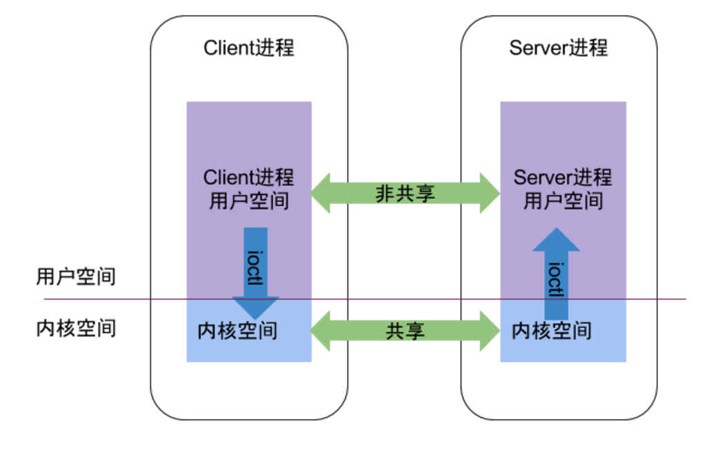

Linux中，为了保证内核安全，用户空间不能直接操作内核，从而将进程分为**用户空间和内核空间** 。对于用户空间，不同进程之间是不能彼此共享的，而对于内核空间，不同进程是可以共享的。在Binder机制中，Client进程向Server进程通信，本质上就是利用**内核空间可共享的原理** 。

### 2.Binder原理： 

Binder通信采用客户端/服务端的架构，Binder定义了四个角色：Server，Client，ServiceManager（简称SMgr）以及Binder驱动。其中Server，Client，SMgr运行于用户空间，驱动运行于内核空间。

### Binder机制包括以下五个部分：

- Binder驱动

  Binder驱动的核心是**维护一个binder_proc类型的链表** 。里面记录了包括ServiceManager在内的所有Client信息，当Client去请求得到某个Service时，Binder驱动就去binder_proc中查找相应的Service返回给Client，同时增加当前Service的引用个数。

- Service Manager

  ​	Service Manager主要**负责管理Android系统中所有的服务** ，当客户端要与服务端进行通信时，首先就会通过Service Manager来查询和取得所需要交互的服务。每个服务需要向Service Manager注册自己提供的服务。

- 服务端

  ​	通常是Android的系统服务，通过Service Manager可以查询和获取到某个Server。

- 客户端

  ​	一般指Android系统上的应用程序，它可以向ServiceManager请求Server中的服务，常见的客户端是Activity。

- 服务代理

  ​	服务代理是指**在客户端应用程序中生成的Server代理** (Proxy)，从应用程序的角度看，代理对象和本地对象没有差别，都可以调用其方法，方法都是同步的，并且返回相应的结果。服务代理也是Binder机制的核心模块。

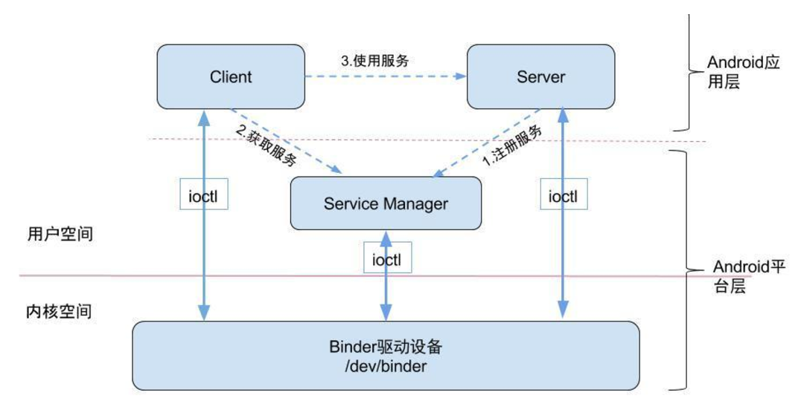

Binder是Android中的一个类，它实现了IBinder接口，从Android应用层来说，Binder是**客户端与服务端进行通信的媒介**(代理)，当bindService的时候，服务端就返回一个包含服务端业务的Binder对象， 通过这个Binder对象，客户端就可以获取**服务端提供的服务或者数据**，这里的服务包括普通服务和基于AIDL的服务。

### 3.Binder通讯流程


Binder工作机制


### Binder实例分析 

一个跨进程调用系统服务的简单例子：

```java
//获取WindowManager服务
WindowManager wm = (WindowManager)getSystemService(getApplicationContext().WINDOW_SERVICE);
//使用LayoutInflater生成一个View对象
View view = LayoutInflater.from(getApplicaiton()).inflate(R.layout.view,null);
//添加iew
wm.addView(view,layoutParams);
```

这个过程分为三个步骤：

* 注册服务：在Android开机启动的过程中，Android会初始化系统地各种Service，并将这些Service向ServiceManager注册（即让ServiceManager管理）。这一步是系统自动完成的。
* 获取服务：客户端想要得到具体的Service直接向ServiceManager要即可。客户端首先向ServiceManager查询得到具体的Service引用，通常是Service引用的代理对象，对数据进行一些处理操作。在`getSystemService()` 过程中得到的wm是WindowManager对象的引用。
* 使用服务：通过这个引用向具体的服务端发送请求，服务端执行完成后就返回。对于WindowManager的`addView`函数，将触发远程调用，调用的是运行在systemServer进程中的WindowManager的addView函数。

**Binder系统架构图**:


**Binder各组件之间的关系：**


****


[回到目录](#index)

<h2 id="IPC——跨进程通讯">IPC——跨进程通讯</h2>

### Serializable接口

使用方法：

serialVersionUID是用来辅助序列化和反序列化操作的，只有数据中的serialVersionUID和当前类中的serialVersionUID一样，才可以被反序列化。

```java
public class User implements Serializable{
  //声明一个serialVersionUID;
  private static final long serialVersionUID = 123L;
  
  public int userId;
  public String userName;
  public boolean isMale;
  ....
}
```

序列化：

```java
User user = new User(0,"jake",true);
ObjectOutPutStream out = new ObjectOutputStream(new FileOutputStream("cache.txt"));
out.writeObject(user);
out.close();
```

反序列化：

```java
ObjectInputStream in = new ObjectInputStream(new FileInputStream("cache.txt"));
User newUser = (User)in.readObject();
in.close();
```

### Parcelable接口

使用方法：

```java
public class User implements Parcelable{
  public int userId;
  public String userName;
  public boolean isMale;
  
  public Book book;//可序列化对象
  public User(int userId,String userName,boolean isMale){
    this.userId = userId;
    this.userName = userName;
    this.isMale = isMale;
  }
  //几乎在大部分情况下都返回0，只有当前对象中存在文件 描述符号时，该方法返回1
  public int describeContents(){
    return 0;
  }
  
  public void writeToParcel(Parcel out ,int flags){
    out.writeInt(userId);
    out.writeString(userName);
    out.writeInt(isMale?1:0);
    out.writeParcelable(book,0);
  }
  
  //反序列化
  public static final Parcelable.Creater<User> CREATOR = new Parcelable.Creator<User>() {
    public void createFromParcel(Parcel in){
      return new User(in);
    }
    public User[] newArray(int size){
      return new User[size];
    }
  }
  
  private User(Parcel in){
    userId = in.readInt();
    userName = in.readString();
    isMale = in.readInt() == 1;
    book = in.readParcelable(Thread.currentThread().getContextClassLoader());
  }
}


```


### 实现IPC的六种方式

简记：**A  B  C  F  S  M**

A--AIDl  B--Bundle  C--ContentProvider 

F--File    S--Socket   M--Mesenger     

1.使用Bundle      

android的四大组件都可使用Bundle传递数据  所以如果要实现四大组件间的进程间通信 完全可以使用Bundle来实现 简单方便  。

优点：**简单易用**

缺点：**只能传输Bundle支持的数据类型**

适用场景：**用于android四大组件间的进程间通信**。

2.文件共享

这种方式在单线程读写的时候比较好用， 如果有多个线程并发读写的话需要限制线程的同步读写 。另外 SharePreference是个特例  它底层基于xml实现  但是系统对它的读写会基于缓存，也就是说再多进程模式下就变得不那么可靠了，有很大几率丢失数据。

优点：**简单易用**

缺点：**不适合高并发场景，并且无法做到进程间的及时通讯**

适用场景：**无并发访问的情形，交换简单的数据，数据实时性要求不高的场景**。

3.AIDL

优点：**功能强大，支持一对多并行通信，支持实时通信**

缺点：**使用稍微复杂，需要处理好线程同步**

适用场景：**一对多通信，远程过程调用（RPC）的场景**

4.Messenger

Messenger 可以翻译为信使，通过该对象，可以在不同的进程中传递Message对象。

客户端向服务端发送消息，可分为以下几步。

服务端

- 创建Service
- 构造Handler对象，实现handlerMessage方法。
- 通过Handler对象构造Messenger信使对象。
- 通过Service的onBind()返回信使中的Binder对象。

客户端

- 创建Actvity
- 绑定服务
- 创建ServiceConnection,监听绑定服务的回调。
- 通过onServiceConnected()方法的参数，构造客户端Messenger对象
- 通过Messenger向服务端发送消息。

实现服务端

```java
public class MessengerService extends Service {
    //构建handler 对象
    public static Handler handler = new Handler(){
        public void handleMessage(android.os.Message msg) {
            // 接受客户端发送的消息
            String msgClient = msg.getData().getString("msg");
            Log.i("messenger","接收到客户端的消息--"+msgClient);
          // 获取客户端Messenger 对象
           Messenger messengetClient = msg.replyTo;
          
           // 向客户端发送消息
            Message message = Message.obtain();
            Bundle data = new Bundle();
            data.putString("msg", "ccccc");
            message.setData(data);
            try {
                // 发送消息
                messengetClient.send(message);
            } catch (RemoteException e) {
                // TODO Auto-generated catch block
                e.printStackTrace();
            }
        };
    };
    // 通过handler 构建Mesenger 对象
    private final Messenger messenger = new Messenger(handler);
    @Override
    public IBinder onBind(Intent intent) {
        // 返回binder 对象
        return messenger.getBinder();
    }
}
```

实现客户端

```java
public class MessengerActivity extends AppCompatActivity {  
    //Messenger 对象
    private Messenger mService;
  
   public static Handler handler = new Handler(){
        public void handleMessage(android.os.Message msg) {
            // 接受服务端发送的消息
            String msgService = msg.getData().getString("msg");
        };
    };
  
 // 通过handler 构建Mesenger 对象
    private final Messenger messengerClient = new Messenger(handler);
  
    private ServiceConnection conn = new ServiceConnection() {
        public void onServiceConnected(ComponentName name, IBinder service) {
            // IBinder 对象
            // 通过服务端返回的Binder 对象 构造Messenger 
            mService = new Messenger(service);
            Log.i("messenger", "客户端以获取服务端Messenger对象");
        }
        public void onServiceDisconnected(ComponentName name) {
        }
    };
    protected void onCreate(@Nullable Bundle savedInstanceState) {
        super.onCreate(savedInstanceState);
        setContentView(R.layout.activity_messenger);
        // 启动服务
        Intent intent = new Intent(this, MessengerService.class);
        bindService(intent, conn, BIND_AUTO_CREATE);
    }
    // 布局文件中添加了一个按钮，点击该按钮的处理方法
    public void send(View view) {
        try {
            // 向服务端发送消息
            Message message = Message.obtain();
            Bundle data = new Bundle();
            data.putString("msg", "lalala");
            message.setData(data);
          
            // ----- 传入Messenger 对象,这样客户端可以接受服务端传回来的消息
            message.replyTo = messengerClient;
          
            // 发送消息
            mService.send(message);
            Log.i("messenger","向服务端发送了消息");
        } catch (Exception e) {
            e.printStackTrace();
        }
    }
}
```

如果需要服务端和客户端能够双向通信，则在每一边都需要有Messenger和Handler，Messenger用来发送消息，在Handler中的handleMessage()中接受Message中的数据。

优点：**功能一般，支持一对多串行通信，支持实时通信**

缺点：**不能很好的处理高并发情形，只能传递Bundle能携带的数据**

适用场景：**低并发的一对多及时通信，无RPC需求**

5.ContentProvider

ContentProvider是Android中提供的，专门用于不同应用间进行数据共享的方式。

创建一个自定义的ContentProvider，继承ContentProvider，并实现六个方法：

```java
public class BookPrivider extends ContentProvider{
  public boolean onCreate(){
    *****
    //返回true则代表BookProvider已成功创建
    return true;
  }
  public String getType(Uri uri){
    ******
  }
  public Cursor query(Uri uri,String[] projection,String selection,String[] selectionArgs,String sortOrder){
    *****
  }
  public int delete(Uri uri,String selection,String[] selectionArgs){
  	****  
  }
  public Uri insert(Uri uri,ContentValues values){
    ****
  }
  public int update(Uri uri,ContentValues values,String selection,String[] selectionArgs){
    
    
  }
}
```

在AndroidManifest.xml中声明ContentProvider:

android:authorities是ContentProvider的唯一标识，android:permission是要求访问者必须声明的权限，如果没有这个权限，则不能访问。

```java
<provider
  android:name="xx.xxx.BookProvider"
  android:authorities="aaa.bbb.ccc"
  android:permission="rrr.ttt.bbb"
  >
</provider>
```

使用ContentResolver访问ContentProvider共享出来的数据：

```java
***
//这个Uri就是在content后面加上authorities
Uri uri = Uri.parse("content://aaa.bbb.ccc");
ContentResolver resolver = getContentResolver();
resolver.query(uri,null,null,null,null);
****
```

优点：**在数据源访问方面功能强大，支持一对多并发数据共享**

缺点：**这相当于一种受约束的AIDL，主要提供数据源的CRUD操作**

适用场景：**一对多的进程间的数据共享**

6.Socket

服务端：

```java
*****
//使用端口为参数，创建ServerSocket对象
ServerSocket ss = new ServerSocket(12345);
*****
// 获取客户端的Socket 对象
Socket socket = ss.accept();

// 获取输入流  --- 
BufferedReader br = new BufferedReader(new InputStreamReader(socket.getInputStream()));
// 通过输入流读取客户端的消息
//String line = br.readLine();
// 输出流
BufferedWriter bw = new BufferedWriter(new OutputStreamWriter(socket.getOutputStream()));
// 通过输出流向客户端发送消息
//bw.write("....");

// 关闭连接
socket.close();
```

客户端：

```java
**** 
Socket s = new Socket("localhost", 12345);
// ----- 和服务端类似
BufferedReader br = new BufferedReader(new InputStreamReader(s.getInputStream()));
//String line = br.readLine();
// 输出流
BufferedWriter bw = new BufferedWriter(new OutputStreamWriter(s.getOutputStream()));
//bw.write("....");
// 关闭连接
s.close();
```

优点：**功能强大，可以通过网络传输字节流，支持一对多并发实时通信**

缺点：**实现细节有点繁琐，不支持RPC**

适用场景：**网络数据交换**

[回到目录](#index)

<h2 id="View的绘制流程">View的绘制流程</h2>

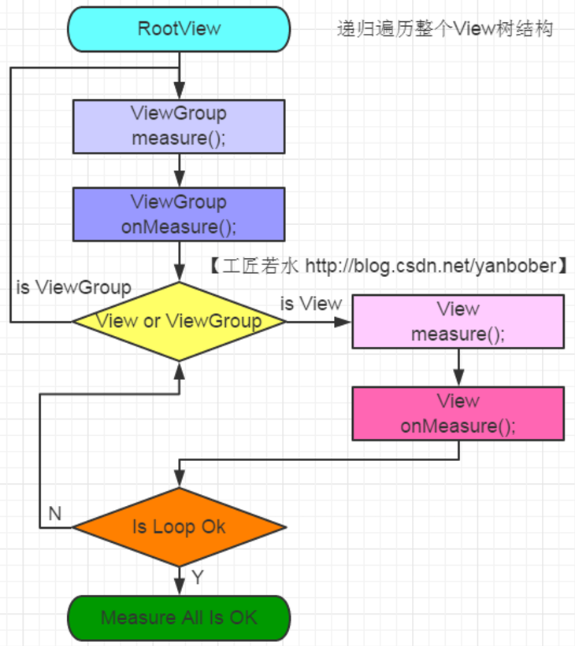


[回到目录](#index)

<h2 id="自定义View和ViewGroup">自定义View和ViewGroup</h2>

一、自定义属性的声明与获取

1.在value目录下创建自定义属性的xml，文件名随意起，比如attr.xml

```java
<?xml version="1.0" encoding="utf-8"?>
<resources>
   <declare-styleable name="CircleView">
      <attr name="circle_color" format="color"/>
  	  <attr name="circle_radius" format="dimension"/>
  	  /*****/
   </declare-styleable>
</resources>
```

2.布局文件中使用自定义属性

```java
...
xmlns:app="http://schemas.android.com/apk.res-auto"
...

<com.XXX.CircleView
    ...
    app:circle_color="@color/light_green"
    app:circle_radius="5dp"
    ...
    />
```

3.在View构造方法中获取自定义属性（使用TypedArray）

```java
int Color mColor;
int radius mRadius;
//***** 
public CircleView(Context context, AttributeSet attrs, int defStyleAttr){
   super(context, attrs, defStyleAttr);
     TypedArray a = context.getTheme().obtainStyledAttributes(attrs, R.styleable.CircleRotateView, defStyleAttr, 0);
     //或使用这种方式：TypedArray a = context.obtainStyledAttributes(attrs, R.styleable.CircleView);
  for(int i=0;i<a.getIndexCount();i++) {
     int attr = typedArray.getIndex(i);
     switch(attr){
       case R.styleable.CircleView_circleColor:
         mColor  = a.getColor(attr, Color.BLACK);
         break;
       case R.styleable.CircleView_circleWidth:
         mRadius = a.getDimensionPixelSize(attr, 10);
         break;
         /****/   
     }
  }
   a.recycle();
   init();
}
```

二、测量onMeasure()

在onMeasure()中对自定义View的宽高进行测量。

MeasureSpec 代表测量规则，而它的手段则是用一个 int 数值来实现。一个 int 数值有 32 bit。MeasureSpec 将它的高 2 位用来代表测量模式 Mode，低 30 位用来代表数值大小 Size。通过`getMode()` 和 `getSize()` 可以逆向地将一个 measureSpec 数值解析出它的 Mode 和 Size。

3种测量模式：

* **MeasureSpec.EXACTLY** ：此模式说明可以给子元素一个精确的数值。当 layout_width 或者 layout_height 的取值为 **match_parent**  或者 明确的数值如 **100dp**  时，表明这个维度上的测量模式就是 MeasureSpec.EXACTLY。
* **MeasureSpec.AT_MOST** ：该模式下，子 View 希望它的宽或者高由自己决定。ViewGroup 当然要尊重它的要求，但是也有个前提，那就是你不能超过我能提供的最大值，也就是它期望宽高不能超过父类提供的建议宽高。当一个 View 的 layout_width 或者 layout_height 的取值为**wrap_content**  时，它的测量模式就是 MeasureSpec.AT_MOST。
* **MeasureSpec.UNSPECIFIED** ：此种模式表示无限制，子元素告诉父容器它希望它的宽高想要多大就要多大，你不要限制我。一般不需要处理这种情况，在 ScrollView 或者是 AdapterView 中都会处理这样的情况。所以可以在一般情形下忽视它。

```java
public void onMeasure(int widthMeasureSpec,int heightMeasureSpec){
  int resultWidth,resultHeight;
  int widthMode = MeasureSpec.getMode(widthMeasureSpec);
        //测量得到的宽度
        int widthSize = MeasureSpec.getSize(widthMeasureSpec);
        int heightMode = MeasureSpec.getMode(heightMeasureSpec);
        //测量的到的高度
        int heightSize = MeasureSpec.getSize(heightMeasureSpec);
  if(widthMode==MeasureSpec.EXACTLY){
    resultWidth = widthSize;
  }else{
    //这里的MeasureSpec就是MeasureSpec.AT_MOST
    //这里的widthSize就是父控件给的最大的大小，至多不能超过widthSize，这里只要把resultWidth设置为小于widthSize的值就可以。
    resultWidth = widthSize/2;
  }
  //对于resultHeight可以进行类似的处理
  
  setMeasuredDimension(resultWidth,resultHeight);
  
  
}
```

当需要动态改变自定义View的位置或大小时（如改变文本而引起的自定义view变化），应该调用`requestLayout()` 方法。requestLayout()方法会重新对自定义View进行测量和布局。

`requestLayout()` 和`invalidate() ` 的区别如下：

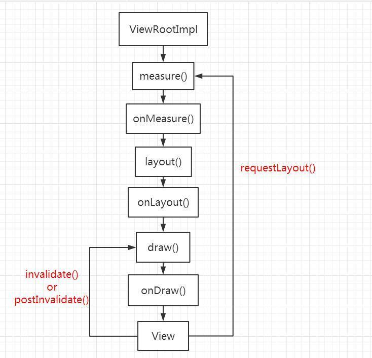

三、布局onLayout()。（只有自定义ViewGroup需要这一步。自定义View不需要）

1.决定子View的位置

```java
proceted void onLayout(boolean changed,int left,int top,int right,int bottom){
  final int childrenCount = getChildCount();
  for(int i=0;i<childrenCount;i++){
    View childView = getChildAt(i);
     cWidth = childView.getMeasuredWidth();  
     cHeight = childView.getMeasuredHeight();  
     cParams = (MarginLayoutParams) childView.getLayoutParams();  
    if(child.getVisibility()==GONE){
      continue;
    }
    //根据情况去计算childView 的左上角x坐标。
    left = caculateChildLeft();//非原生可调函数
    top = caculateChildTop();//计算childView的左上角的y坐标
    child.layout(left,top,left+cWidth,top+cHeight);
  }
  
  
}
```


四、绘制onDraw()

在`onDraw(Canvas canvas)中` 调用canvas的一系列API来绘制View：

```
canvas.drawXXX
```

对Canvas进行变换：平移`translate` ，旋转`rotate` ，缩放`scale` ，倾斜`skew` 等等。

在运用这些变换的时候要注意使用`save()` 来保存犯罪现场，使用`restore()` 来恢复犯罪现场。  

onDraw()中不建议进行`new` 操作，这样会减慢速度。

[回到目录](#index)

<h2 id="TouchEvent事件的传递机制">TouchEvent事件的传递机制</h2>

点击事件的分发与以下几个方法相关：

* `public boolean dispathchTouchEvent(MotionEvent event)` 
* `public boolean onInterceptTouchEvent(MotionEvent event)` 
* `public boolean onTouchEvent(MotionEvent event) ` 

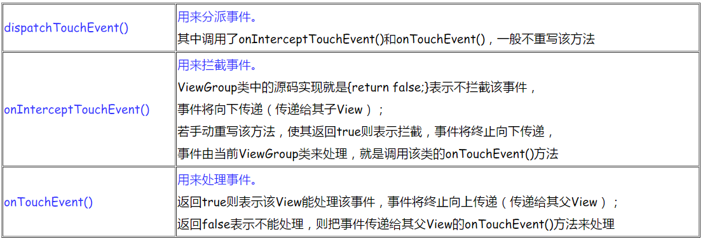

只有ViewGroup才能对事件进行拦截：

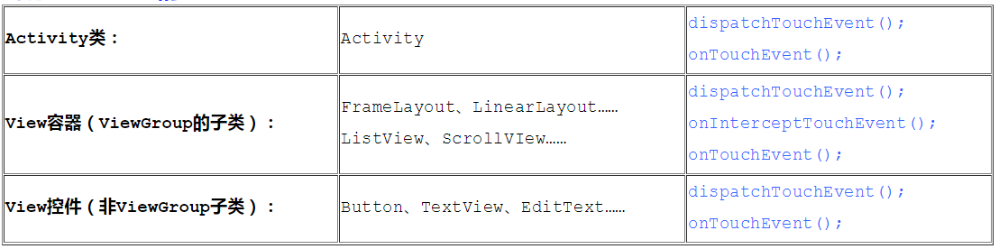


如果Activity的所有子View都不处理事件，则最后会调用Activity的onTouchEvent():


如果在最底层View处理：

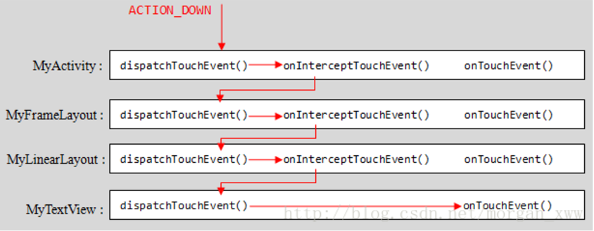

如果在中途View处理了该事件，则不会继续向下进行事件分发：

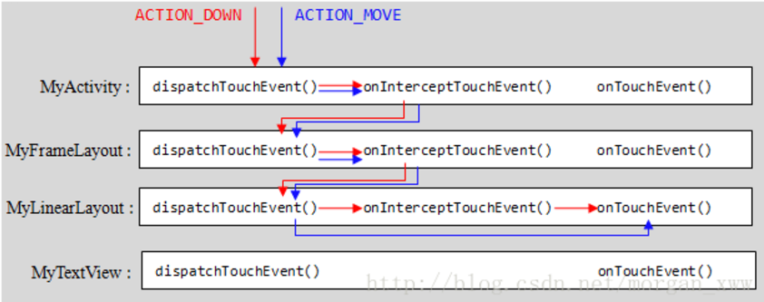

当一个View需要处理某个事件时，如果设置了OnTouchListener，则OnTouchListener中的`onTouch()` 方法会先调用，返回true则代表处理完成，就不会再交给`onTouchEvent()` 了。如果在`onTouch()`中返回false，表示没有处理该事件，则才会调用`onTouchEvent()` ，在onTouchEvent()中，如果设置有OnClickListener，那么它的`onClick()` 会被调用。优先级：onTouchListener-->onTouchEvent()-->OnClickListener。

**同一事件序列只能被一个View拦截并消耗** 。一个事件序列是指从手指触碰到屏幕的一瞬间，到手指离开屏幕的那一段时间，在这个过程中产生的一系列事件，这个事件序列以`ACTION_DOWN` 开始，中间含有若干的`ACTION_MOVE` 事件，最终以`ACTION_UP` 事件结束。

某个View一旦决定拦截事件，那么一个事件序列都只能由它处理，并且后续它的`onInterceptTouchEvent()` 将不会被调用。因为一旦某个View决定要拦截，系统不会再次问它是否要拦截了，即`onInterceptTouchEvent()` 不再调用。

某个View一旦开始处理事件，如果他不消耗ACTION_DOWN事件(`onTouchEvent()` 返回false)，那么同一事件序列中的其他事件都不会交给它处理，而是重新交给它的父元素去处理，即父View的`onTouchEvent()` 会被调用。

事件传递过程：事件最先传递到Activity，Activity会把事件分发的具体工作交给**PhoneWindow** 来做(PhoneWindow是用来控制顶级View的外观和行为策略的)，而PhoneWindow又将事件传递给了顶级的**DecorView** （DecorView继承自FrameLayout），然后这个DecorView会将事件进行向下分发，分发给其子ViewGroup和View等，然后在子ViewGroup中会进行`dispatchTouchEvent()`依次往下分发， --> 判断是否拦截 `onInterceptTouchEvent()` -->如果拦截则处理:`onTouchEvent()` ，如果不拦截则继续往下分发。

**最底层的View没有 `dispatchTouchEvent()` 方法，它只可以选择对事件进行处理或者不处理** 。

[回到目录](#index)

<h2 id="Android中的三种动画">Android中的三种动画</h2>

### 逐帧动画

逐帧动画，把动画过程的每张静态图片都收集起来，然后由Android来控制依次展示这些静态图片，再利用人眼“视觉暂留”的原理，给用户以“动画”的感觉。实际就是一帧接着一帧的播放图片，就像放电影一样。

逐帧动画放在/drawable文件夹下，逐帧动画的语法：

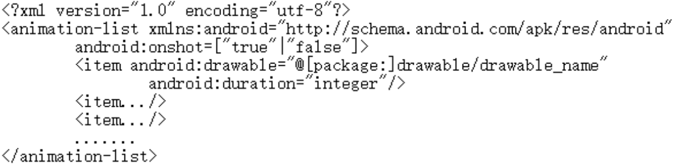

每一个`<item>` 都对应着一帧。

使用示例：

先在imageView的xml中指定逐帧动画：

```java
<ImageView
  android:id="@+id/iv"
  android:layout_width="wrap_content"
  android:layout_height="wrap_content"
  android:background="@drawable/anim.xml"/>
```

然后在java代码中使用：

```java
AnimationDrawable anim = (AnimationDrawable)imageView.getBackground();

//开始播放
anim.start();
//停止播放
anim.stop();
```

### 补间动画

补间动画就是，开发者只需指定动画开始、动画结束等“关键帧”，而动画变化的“中间帧”由系统计算并补齐。补间动画是操作某个控件让其展现出旋转、渐变、移动、缩放等转换过程。我们可以用XML形式定义动画，也可以编码实现。

补间动画放在res/anim文件夹下(需要手动创建)。

补间动画语法：

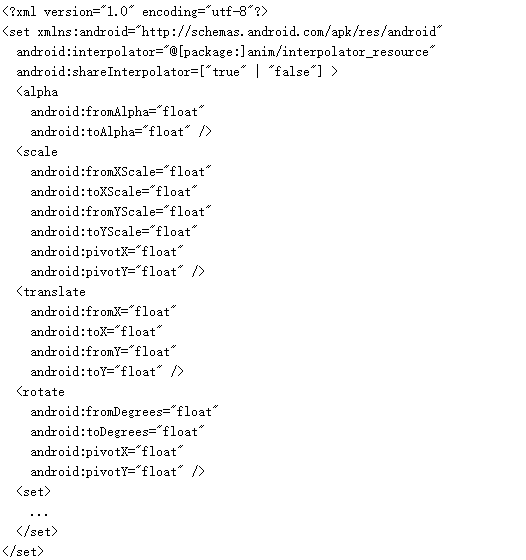

使用示例：

```java
//先加载。my_anim是补间动画名称
Animation anim = AnimationUtils.loadAniation(context,R.anim.my_anim);
anim.setFillAfter(true);
//使用ImageView播放
imageView.startAnimation(anim);

```


### 属性动画

属性动画是增强版的补间动画，属性动画的强大可以体现在如下两个方面：1.补间动画只能定义两个关键帧在透明度，旋转，缩放，位移四个方面的变化，但属性动画可以令对象进行更多特征变化。2.补间动画只能对UI组件执行动画，但属性动画几乎可以对任何对象执行动画（不管它是否显示在屏幕上）。

1.Animator	

Animator是属性动画的基类，是一个抽象类，该类中定义了许多重要方法，如下所示：

* setDuration(long duration)：设置动画总共的持续时间，以毫秒为单位。
* start()：通过start方法可以启动动画，动画启动后不一定会立即运行。如果之前通过调用setStartDelay方法设置了动画延迟时间，那么会在经过延迟时间之后再运行动画；如果没有设置过动画的延迟时间，那么动画在调用了start()方法之后会立即运行。
* setStartDelay(long startDelay)：设置动画的延迟运行时间，比如调用setStartDelay(1000)意味着动画在执行了start()方法1秒之后才真正运行。
* setInterpolator(TimeInterpolator value)：改变动画所使用的时间插值器，由于视图动画也需要使用时间插值器，所以我们可以使用android.view.animation命名空间下的一系列插值器，将其与属性动画一起工作。
* pause()：该方法可以暂停动画的执行。调用pause()方法的线程必须与调用start()方法的线程是同一个线程。
* resume()：如果动画通过调用pause()方法暂停了，那么之后可以通过调用resume()方法让动画从上次暂停的地方继续运行。
* end()：动画结束运行，直接从当前状态跳转到最终的完成状态，并将属性值分配成动画的终止值
* addListener (Animator.AnimatorListener listener)：通过addListener方法向Animator添加动画监听器，该方法接收的是AnimatorListener接口类型的参数，其具有四个方法：onAnimationStart、onAnimationCancel、onAnimationEnd、onAnimationRepeat。这四个方法分别在动画被启动，被取消，结束和重复播放时被回调。

2.ValueAnimator

ValueAnimator是属性动画的“时间引擎”，它负责计算各个帧的属性值。中有两个比较重要的属性，一个是TimeInterpolator类型的属性，另一个是TypeEvaluator类型的属性。TimeInterpolator指的就是时间插值器，TypeEvaluator表示的是ValueAnimator对哪种类型的值进行动画处理。	ValueAnimator提供了四个静态方法ofFloat()、ofInt()、ofArgb()和ofObject()，通过这四个方法可以对不同种类型的值进行动画处理，这四个方法对应了四种TypeEvaluator。

* public static ValueAnimator ofFloat (float… values)：ofFloat方法接收一系列的float类型的值，其内部使用了FloatEvaluator。通过该方法ValueAnimator可以对float值进行动画渐变。

ValueAnimator使用示例：

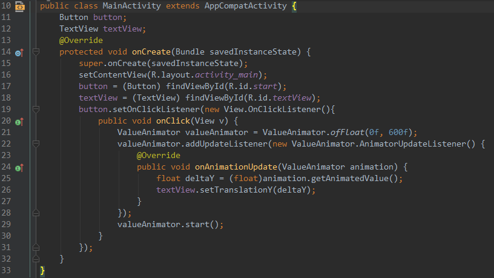

* public static ValueAnimator ofInt (int… values)：ofInt方法与ofFloat方法很类似，只不过ofInt方法接收int类型的值，ofInt方法内部使用了IntEvaluator，其使用可参考上面ofFloat的使用代码。
* public static ValueAnimator ofArgb (int… values)：该方法接收一系列代表了颜色的int值，其内部使用了ArgbEvaluator，可以用该方法实现将一个颜色动画渐变到另一个颜色，我们从中可以不断获取中间动画产生的颜色值。
* public static ValueAnimator ofObject (TypeEvaluator evaluator, Object… values):ValueAnimator提供了一个ofObject方法，该方法接收一个TypeEvaluator类型的参数，我们需要实现该接口TypeEvaluator的evaluate()方法，只要我们实现了TypeEvaluator接口，我们就能通过ofObject方法处理任意类型的数据。

  3.ObjectAnimator

  ObjectAnimator继承自ValueAnimator。要让属性动画渐变式地更改对象中某个属性的值，可分两步操作：第一步，动画需要计算出某一时刻属性值应该是多少；第二步，需要将计算出的属性值赋值给动画的属性。

ValueAnimator只实现了第一步，也就是说ValueAnimator只负责以动画的形式不断计算不同时刻的属性值，但需要我们开发者自己写代码在动画监听器AnimatorUpdateListener的onAnimationUpdate方法中将计算出的值通过对象的setXXX等方法更新对象的属性值。ObjectAnimator比ValueAnimator更进一步它会自动调用对象的setXXX方法更新对象中的属性值。

ObjectAnimator中常用的方法有：

* ofFloat(Object target, String propertyName, float… values)：target是指要操作的对象，propertyName是指属性名，常见的属性名有：“translationX”(表示横向变换)，“translationY”(纵向变换),”alpha”(变换透明度),”rotation”(旋转变换),”backgroundColor”(表示背景色变换)等等。
* ofInt(Object target, String propertyName, int… values)：与float作用相同，只是数据类型的差别。ofObject(Object target, String propertyName, TypeEvaluator evaluator, Object… values) ：与ValueAnimator 中的ofObject类似，都需要传入自定义的TypeEvaluator对象。
* ofObject(Object target, String propertyName, TypeEvaluator evaluator, Object… values) ：与ValueAnimator 中的ofObject类似，都需要传入自定义的TypeEvaluator对象。
* ofArgb(Object target, String propertyName, int… values)：用该方法实现将一个颜色动画渐变到另一个颜色，我们从中可以不断获取中间动画产生的颜色值。

使用示例：

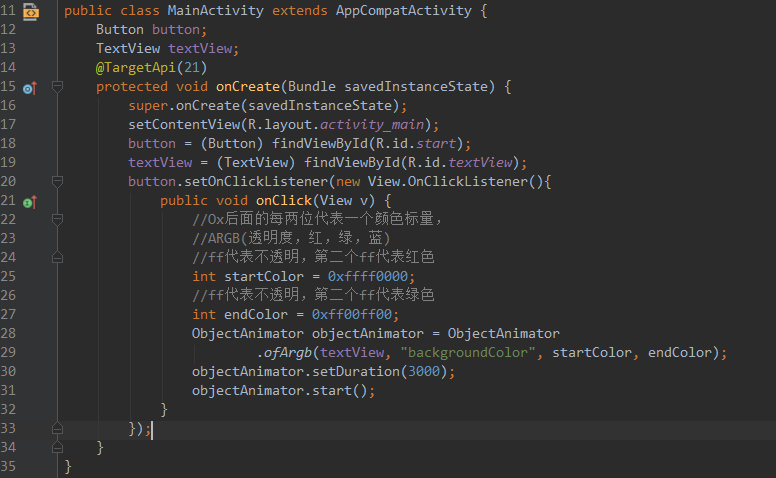

4.AnimatorSet	

AnimatorSet继承自Animator。AnimatorSet表示的是动画的集合，我们可以通过AnimatorSet把多个动画集合在一起，让其串行或并行执行，从而创造出复杂的动画效果。

假设anim1,anim2,anim3,anim4是四个已定义的ObjectAnimator动画对象，AnimatorSet可以使用三种方式进行动画组合()：

```java
//方式一
  AnimatorSet animatorSet = new AnimatorSet();
  animatorSet.playSequentially(anim1, anim2, anim4);
  animatorSet.playTogether(anim2, anim3);
  animatorSet.start();
//方式二
AnimatorSet anim23 = new AnimatorSet();
  anim23.playTogether(anim2, anim3);
  AnimatorSet animatorSet = new AnimatorSet();
  animatorSet.playSequentially(anim1, anim23, anim4);
  animatorSet.start();
//方式三
 AnimatorSet animatorSet = new AnimatorSet();
  animatorSet.play(anim1).before(anim2);
  animatorSet.play(anim2).with(anim3);
  animatorSet.play(anim4).after(anim2);
  animatorSet.start();
```

[回到目录](#index)


<h2 id="AIDL的使用">AIDL的使用</h2>

Android Interface Defining Language，Android接口定义语言。引入AIDL目的是为了实现进程间通信，尤其是在涉及多进程并发情况下的进程间通信。

使用AIDL：

1.在xxx.aidl文件中定义AIDL接口（在module目录下创建aidl文件夹，然后将xxx.aidl文件放在这个文件夹）

```java
interface IMessage{
  String getMessage();
  ***
}
```


2.把项目Rebuild之后，Android Studio会自动为AIDL接口生成一个接口IMessage，该接口继承IInterface，IMessage接口中有一个抽象类Stub，该Stub继承了Binder，并实现了IMessage。这样就可以在Java代码中使用IMessage。

```java
public interface IMessage extends android.os.IInterface{
  *****
  //抽象类Stub
  public static abstract class Stub extends android.os.Binder implements IMessage{
    *****
    public boolean onTransact(int code,Parcel data,Parcel reply,int flags){
      //AIDL接口中的方法是由这个int型的code来标识的
      switch(code){
        case TRANSACTION_getMessage:{
          ****
            break;
        }
        case ****
          ****
          break;
      }
    }
    *****
  }
  
  //代理类Proxy
  private static class Proxy implements IMessage{
    private android.os.IBinder mRemote;
    ****
    //adBinder()返回的是代理对象mRemote
    public android.os.IBinder asBinder(){
      return mRemote;
    }
  }
  public String getMessage(){
    *****
  }
}
```

3.自定义Service（AIDL一般用来调用远程服务）

```java
public class RemoteService extends Service{
  private IMessage.Stub stub = new IMessage.Stub{
    //这里写的是getMessage的具体实现
    public String getMessage(){
      return "Hello Kotlin";
    }
    public void onCreate(){
    	****  
    }
    public int onStartCommand(Intent intent,int flags,int startId ){
      ****
    }
    ****
  }
}
```

4.使用RemoteService

```java
****
private IMessage serv;
//创建ServiceConnection对象
ServiceConnection conn = new ServiceConnection(){
  public void onServiceConnected(ComponentName name,IBinder  service){
    serv = IMessage.Stub.adInterface(service);
    String msg = serv.getMessage();
  }
  public void onServiceDisconnected(ComponentName name){
    ****
  }
  
 ***** 
  //在绑定RemoteService的地方
  Intent intent = new Intent();
  intent.setAction("aa.aa.aaaa");
  intent.setPackage("xx.xx.xx");
  bindService(intent,conn,BIND_AUTO_CREATE);
}
```

[回到目录](#index)


<h2 id="应用程序Activity的启动过程">应用程序Activity的启动过程</h2>

有两种操作会引发Activity的启动，

* 一种是用户点击应用程序图标时，Launcher会为我们启动应用程序的主Activity；应用程序的默认Activity启动起来后，它又可以在内部通过调用startActvity接口启动新的Activity，依此类推，每一个Activity都可以在内部启动新的Activity。通过这种连锁反应，按需启动Activity，从而完成应用程序的功能。
* 通过startActivity的形式启动另一个Activity

无论是通过哪种方式启动，要借助于应用程序框架层的**ActivityManagerService**服务进程。而Service也是由ActivityManagerService进程来启动的。

**在Android应用程序框架层中，ActivityManagerService是一个非常重要的接口，它不但负责启动Activity和Service，还负责管理Activity和Service。**

Android应用程序框架层中的ActivityManagerService启动Activity的过程大致如下图所示：


ActivityManagerService和ActivityStack位于同一个进程中，而ApplicationThread和ActivityThread位于另一个进程中。其中，

1. **ActivityManagerService是负责管理Activity的生命周期的**。
2. ActivityManagerService还借助ActivityStack是来把所有的Activity按照后进先出的顺序放在一个任务栈中。
3. **对于每一个应用程序来说，都有一个ActivityThread来表示应用程序的主进程**，而每一个ActivityThread都包含有一个ApplicationThread实例，它是一个Binder对象，负责和其它进程进行通信。

Activity的启动过程是：

1. 无论是通过Launcher来启动Activity，还是通过Activity内部调用startActivity接口来启动新的Activity，都通过Binder进程间通信进入到ActivityManagerService进程中，并且调用ActivityManagerService.startActivity接口； 
2. ActivityManagerService调用ActivityStack.startActivityMayWait来做准备要启动的Activity的相关信息；
3. ActivityStack通知ApplicationThread要进行Activity启动调度了，这里的ApplicationThread代表的是调用ActivityManagerService.startActivity接口的进程，对于通过点击应用程序图标的情景来说，这个进程就是Launcher了，而对于通过在Activity内部调用startActivity的情景来说，这个进程就是这个Activity所在的进程了；
4. ApplicationThread不执行真正的启动操作，它通过调用ActivityManagerService.activityPaused接口进入到ActivityManagerService进程中，看看是否需要创建新的进程来启动Activity；
5. 对于通过点击应用程序图标来启动Activity的情景来说，ActivityManagerService在这一步中，会调用startProcessLocked来创建一个新的进程，而对于通过在Activity内部调用startActivity来启动新的Activity来说，这一步是不需要执行的，因为新的Activity就在原来的Activity所在的进程中进行启动；
6. ActivityManagerServic调用ApplicationThread.scheduleLaunchActivity接口，通知相应的进程执行启动Activity的操作；
7. ApplicationThread把这个启动Activity的操作转发给ActivityThread，ActivityThread通过ClassLoader导入相应的Activity类，然后把它启动起来。


[回到目录](#index)


