# Android面试知识点归纳(2)

<h3 id="index">目录</h3>

* [Handler原理](#Handler原理)
* [内存泄露以及优化](#内存泄露以及优化)
* [ JVM虚拟机/Dalvik/ART](#JVM虚拟机/Dalvik/ART)
* [Android开机启动流程](#Android开机启动流程)
* [热修复](#热修复)
* OKHtttp源码分析


<h2 id="内存泄露以及优化">内存泄露以及优化</h2>

内存泄露：当一个对象已经不需要再使用了，本该被回收时，而有另外一个正在使用的对象持有它的引用从而导致它不能被回收，这导致本该被回收的对象不能被回收而停留在堆内存中，这就产生了内存泄漏。

### Android系统内存分配与回收

* 一个APP就是一个Linux进程，同时也是一个JVM中的进程。Andorid中的APP进程都是由Linux的**Zygote进程** fork出来的。
* GC(垃圾回收器)只有在Heap剩余空间不够的时候才发出垃圾回收。引入GC的优点就是不需要我们手动的进行垃圾回收。但是GC的缺点就是，APP在运行过程中不断的申请内存分配，当发现系统分配给我们的Heap不够用了，然后才进行垃圾回收。
* GC触发时，所有的线程都会被暂停。

APP的内存限制机制：

* 系统会默认给每个APP设置一个最大的内存限制，随不同设备而不同。（通常会是256M）
* 吃内存大户：图片。

切换应用时后台APP清理机制：

* Android是使用分时复用的方式，可以多个应用同时运行，在前台与用户交互的只有一个，在后台运行的可以有多个。APP切换时是采用**LRU** (Least recently used,最近最少使用) 方式，最近使用的排在最前面，被清理的可能性最小。排在末尾的最有可能被清理。
* 当系统清理后台进程时，会触发Activity 的 `onTrimMemory()` 方法。

### APP内存优化方法

1.对于生命周期比Activity长的对象如果需要应该使用ApplicationContext。

2.对于需要在静态内部类中使用**非静态外部成员变量** （如：Context、View )，可以在静态内部类中使用**弱引用** 来引用外部类的变量来避免内存泄漏。

3.对于不再需要使用的对象，显示的将其赋值为null，比如使用完Bitmap后先调用recycle()，再赋为null。

4..保持对对象生命周期的敏感，特别注意单例、静态对象、全局性集合等的生命周期。

5.对于生命周期比Activity长的内部类对象，并且内部类中使用了外部类的成员变量，可以这样做避免内存泄漏：

* 将内部类改为静态内部类
* 静态内部类中使用弱引用来引用外部类的成员变量

6.数据结构优化：(1)频繁地拼接字符串应该使用StringBuilder，而不应该采用+的方式（该方式会产生很多的中间字符串）。(2)使用ArrayMap ,SparseArray替换HashMap，效率更高。(3)内存抖动：由于变量使用不当，在短时间内申请了大量的内存，用完后便马上弃之不用。过了一会又去申请大量内存，用完再弃之不用。应该尽量避免内存抖动。(4)注意：再小的Class都会耗费0.5KB。HashMap里一个entry需要额外占用32B。

7.对象复用：(1)复用系统自带的资源。(2)ListView/GridView的ConvertView复用。(3)避免在onDraw()里面执行对象的创建。

8.避免内存泄露：内存泄露会导致剩余可用的Heap越来越少，频繁触发GC。(1)在使用Context的地方，尽量用Applicaion Context而不是 Activity Context。(2)在执行数据库相关操作时，将Cursor对象及时关闭。(3)Bitmap的在不用的时候应及时调用`recycle()`。

### OnTrimMemory()

Activity的`onTrimMemory(int level)` ，level有以下几个常量值：

* TRIM_MEMORY_BACKGROUND：表示该APP当前是处于后台，已经被放在了LRU队列中。
* TRIM_MEMORY_COMPLETE：表示该应用已经处于LRU队列的末端，如果手机内存紧张的时候就会被清除掉。这是最危险的级别。
* TRIM_MEMORY_MODERATE：表示当前应用处于LRU的中部，内存紧张时还暂时不会KILL该进程。
* TRIM_MEMORY_RUNNING_MODERATE：表示应用程序正常运行，并且不会被杀掉。但是目前手机的内存已经有点低了，系统可能会开始根据LRU缓存规则来去杀死进程了。
* TRIM_MEMORY_RUNNING_LOW ：表示应用程序正常运行，并且不会被杀掉。但是目前手机的内存已经非常低了，我们应该去释放掉一些不必要的资源以提升系统的性能，同时这也会直接影响到我们应用程序的性能。
* TRIM_MEMORY_RUNNING_CRITICAL：表示应用程序仍然正常运行，但是系统已经根据LRU缓存规则杀掉了大部分缓存的进程了。这个时候我们应当尽可能地去释放任何不必要的资源，不然的话系统可能会继续杀掉所有缓存中的进程，并且开始杀掉一些本来应当保持运行的进程，比如说后台运行的服务。
* TRIM_MEMORY_UI_HIDDEN：点击了Home键之后，会收到这个级别的通知。


<h2 id="Handler原理">Handler原理</h2>

### ThreadLocal

ThreadLocal是一个**线程内部的数据存储类** ，实质上是一个泛型类，定义为：public class ThreadLocal<T>。通过它可以在某个指定线程中存储数据，数据存储以后，只有在**指定线程(存储数据的线程)** 中可以获取到它存储的数据，对于其他的线程来说无法获取到它的数据。

通过使用ThreadLocal，能够让同一个数据对象在不同的线程中存在多个副本，而这些副本互不影响。Looper的实现中便使用到了ThreadLocal。通过使用ThreadLocal，每个线程都有自己的Looper，它们是同一个数据对象的不同副本，并且不会相互影响。

ThreadLocal中有一个内部类ThreadLocalMap，ThreadLocal中有一个内部类Entry，Entry中的`Object value `这个value实际上就是每一个线程中的数据副本。ThreadLocalMap中有一个存放Entry的数组：`Entry[] table`。 ThreadLocal类的部分代码如下：

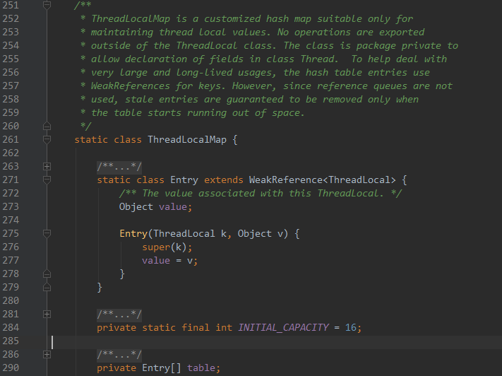

ThreadLocal的`set` 方法：实际上就是往ThreadLocalMap对象(map)维护的对象数组table中插入数据。

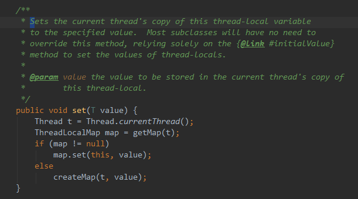

ThreadLocal的`get` 方法，调用了ThreadLocalMap的getEntry()方法：

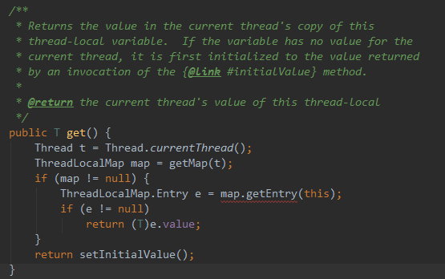

ThreadLocalMap的`getEntry()` 方法:

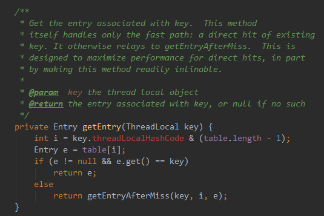

i的值是由线程的哈希码和（table的长度-1）进行“按位与”运算，所有每个线程得到的i是不一样的，因此最终数据副本在table中的位置也不一样。

### MessageQueue

MessageQueue主要包含两个操作，插入和读取。读取操作的函数是`next()` ，该操作同时也会伴随着删除操作(相当于出队列)，插入操作对应的函数是`enqueueMessage()` ，`enqueueMessage()` 实际上就是单链表的插入操作。`next()` 方法是一个无限循环的方法，如果消息队列中没有消息，那么next()方法会一直阻塞。当有新消息到来时，next()方法会返回这条消息并将其从单链表中移除。

### Looper

Looper在Android的消息机制中扮演着消息循环的角色，它会不停地从MessageQueue中查看是否有新的Message到来，如果有新消息就会立刻处理，否则就一直阻塞在那里。一个线程只能有一个Looper对象，从而也只有一个MessageQueue(在Looper的构造方法初始化)。

Looper中的几个重要的成员变量：

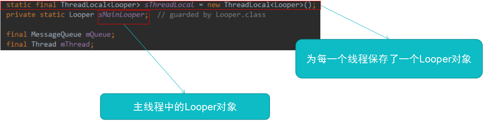

Looper的构造方法，在构造方法中，创建了一个**MessageQueue** 实例：

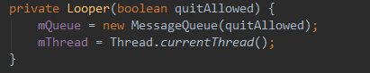

当需要为一个线程创建Looper对象时，需要调用Looper的`prepare()` 方法（该方法在一个线程中只能调用一次，否则会抛出异常）：

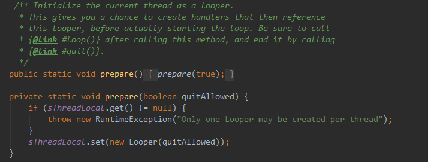

在`loop()` 的消息循环中，实际上是调用了MessageQueue的**next()** 方法。

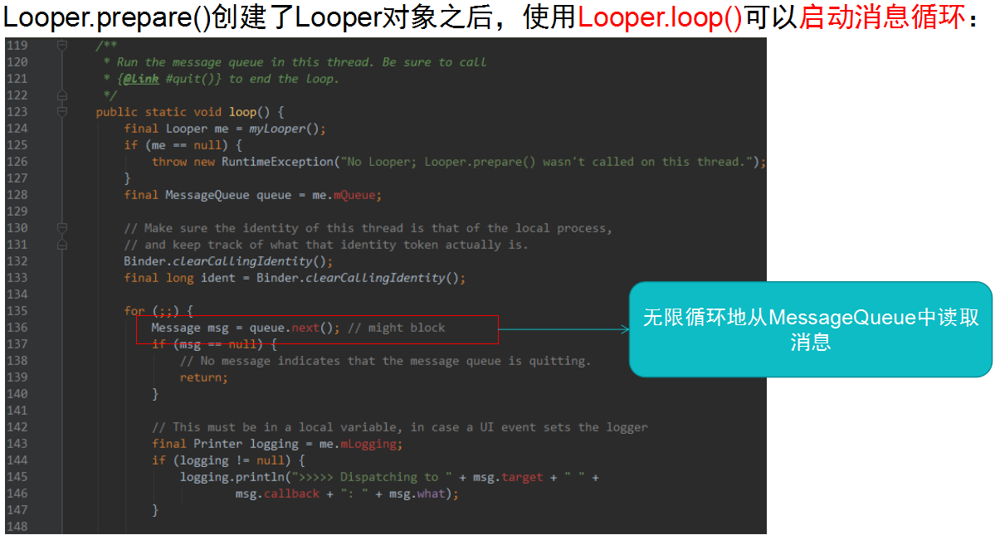

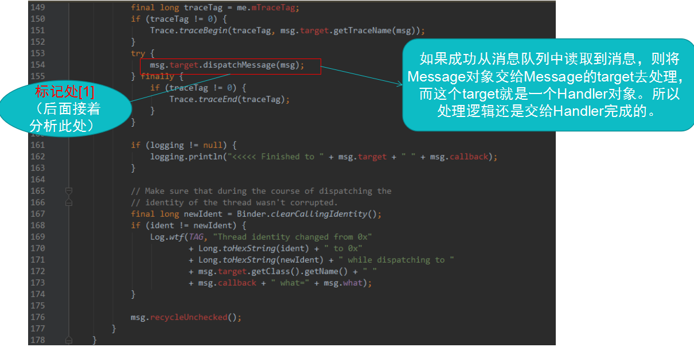

Looper主要作用：
1、	与当前线程绑定，保证一个线程只会有一个Looper实例，同时一个Looper实例也只有一个MessageQueue。
2、	loop()方法，不断从MessageQueue中去取消息，交给消息的target属性的dispatchMessage去处理。

### Handler

Handler的工作主要是消息的发送和消息接收处理。消息的发送可以通过Handler的`post()` 方法或者`sendMessage()` 方法来实现，消息的处理，需要我们重写handleMessage()函数来进行处理。

Handler的sendMessage()函数：

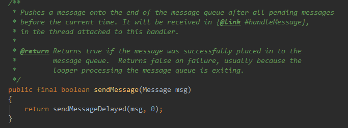

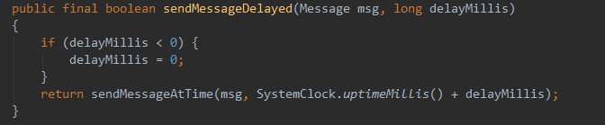


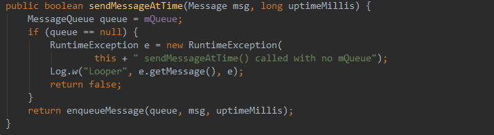

最后调用了MessageQueue的`enqueueMessage()` 函数：


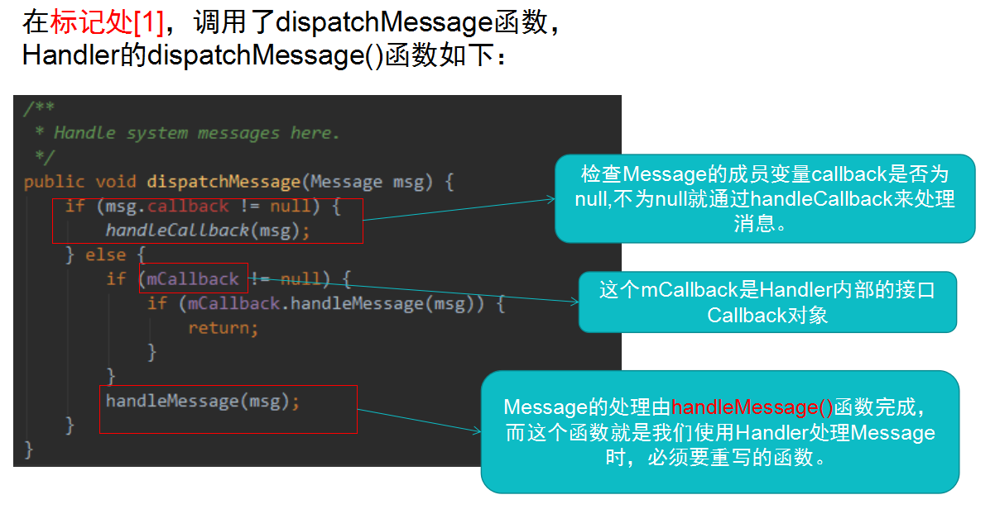

Message 的callback成员变量实际上是一个**Runnable对象** ：

`Runnable callback; `

经常使用的Handler的`post(Runnable r)` 方法，源码是这样的：

```java

    public final boolean post(Runnable r)
    {
       return  sendMessageDelayed(getPostMessage(r), 0);
    }
```

其中，`getPostMessage(r) ` 为：

```java
private static Message getPostMessage(Runnable r) {
        Message m = Message.obtain();
        m.callback = r;
        return m;
    }
```

原来，Handler的`post()`方法实际上是把这个Runnable对象封装到了一个Message中的。

因此，Handler中的事件处理优先级顺序是：

Message.callback(Runnable) -- >  mCallback(Callback接口实现类或Callback匿名内部类)  --->  Handler或其子类的handleMessage()。


[回到目录](#index)

<h2 id="JVM/Davik/ART">JVM/Davik/ART</h2>
### JVM
JAVA程序的执行过程：
* 首先，.java文件经过Java编译器，被编译成字节码文件（.class文件），Java编译器在这个编译过程中做的任务有：语法分析、语义分析、字节码生成等。
* 字节码文件在执行前，先经过类加载机制（加载、连接、初始化）
* 在执行时，字节码文件经过Java虚拟机来执行，Java虚拟机在这个过程中做的工作有：为代码进行机器相关优化和非机器相关的优化，寄存器分配，生成目标代码。

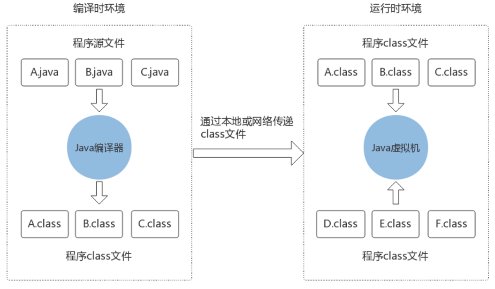

当启动一个java程序时，一个虚拟机实例就诞生了，当程序结束时，这个虚拟机实例也消亡。

Java虚拟机包含一个类加载器（class loader），它可以从程序和API中加载class文件，Java API中只有程序执行时需要的类才会加载。
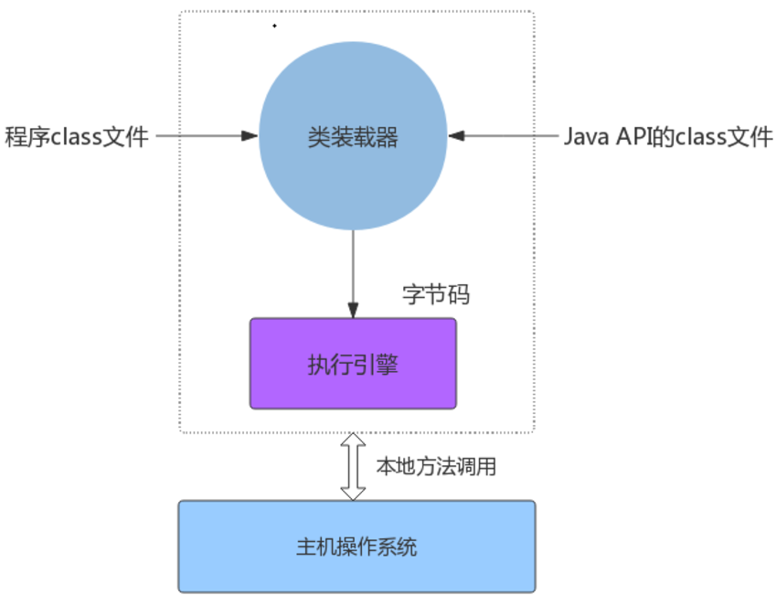


Java虚拟机数据类型：
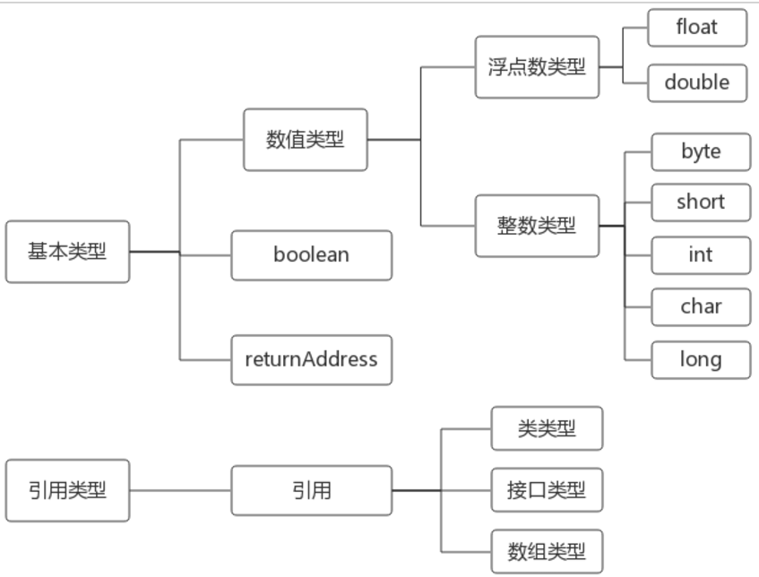
包括两类数据类型：
* 基本类型：char ,byte,short,int ,long,float,double,boolean,还有一个**returnAddress** ，returnAddress 数据类型被用来实现Java程序中的finally 字句，它的值执行一条虚拟机指令的操作码。比如，在一段代码中，一个`try` 包含了两个`catch` 块，returnAddress是用来标记fanally块执行完后返回的位置，如果后面不使用returnAddress，则finally块执行完就不知道要返回到哪里了。
* 引用类型：类类型，接口类型，数组类型。

#### JVM体系结构：
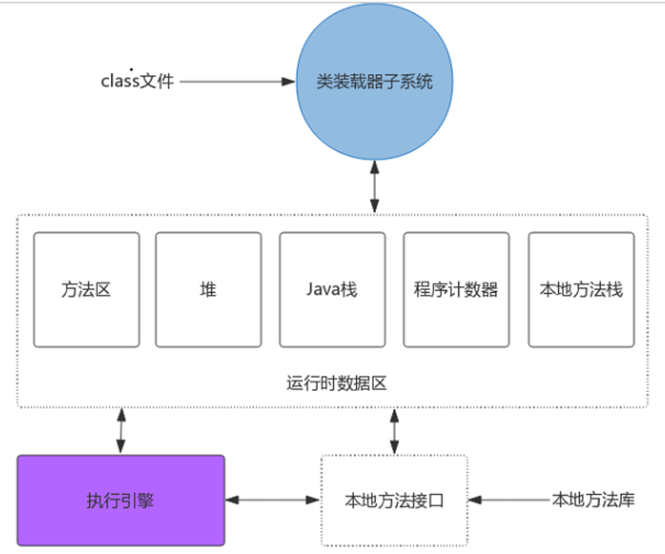
1.class文件：包含了关于类或接口的所有信息，class文件的基本类型如下：
u1 ：代表1个字节，无符号类型
u2 ：代表2个字节，无符号类型
u4 ：代表4个字节，无符号类型
u8 ：代表8个字节，无符号类型

class文件内容包括：
```
ClassFile {

    u4 magic;                                     //魔数：0xCAFEBABE，用来判断是否是Java class文件
    u2 minor_version;                             //次版本号
    u2 major_version;                             //主版本号
    u2 constant_pool_count;                       //常量池大小
    cp_info constant_pool[constant_pool_count-1]; //常量池
    u2 access_flags;                              //类和接口层次的访问标志（通过|运算得到）
    u2 this_class;                                //类索引（指向常量池中的类常量）
    u2 super_class;                               //父类索引（指向常量池中的类常量）
    u2 interfaces_count;                          //接口索引计数器
    u2 interfaces[interfaces_count];              //接口索引集合
    u2 fields_count;                              //字段数量计数器
    field_info fields[fields_count];              //字段表集合
    u2 methods_count;                             //方法数量计数器
    method_info methods[methods_count];           //方法表集合
    u2 attributes_count;                          //属性个数
    attribute_info attributes[attributes_count];  //属性表

}
```

2.类加载器子系统包括四种加载器：
* Bootstrap ClassLoader 启动类加载器
* Extension ClassLoader 扩展类加载器
* Application ClassLoader 应用程序类加载器
* User ClassLoader 自定义类加载器

加载：将类的class文件读入内存中，并为之创建一个java.lang.Class对象
连接：负责把类的二进制数据合并到JRE
初始化：主要是对类变量的初始化。

3.方法区（常量池是在方法区里的！！）
JVM将关于类/接口的一系列信息都存放在了方法区里，方法区中存放了以下信息：
* 类/接口的全限定名（如java.lang.Object这样的）
* 类的直接父类的全限定名
* 这个class文件是**类**还是**接口**
* 访问修饰符
* 常量池：包括直接常量(字符串，整型，和浮点常量等)和对其他类型、字段方法的符号引用。
* 字段信息（字段名，类型，修饰符）
* 方法信息（方法名，修饰符，返回类型，参数数量和类型）
* 除了常量以外的所有类的静态变量


4.堆
Java程序在运行时创建的所有类实例或数组，都放在同一个堆中，由于一个进程（也就是一个JVM实例）只有一个堆空间，因此所有线程共用这个堆空间。Java虚拟机中只有一条在堆中分配对象的指令，却没有释放内存的指令，因为这正是垃圾回收器需要做的事情：回收内存。
（1）存储的全部是对象的实例，每个对象都包含一个与之对应的class的信息。（class的目的是得到操作指令）。
（2）每个jvm实例只有一个堆区（heap）被所有线程共享，堆中不存放基本类型和引用型变量，只存放**对象实例**本身。

5.栈
每当启动一个线程，JVM就会给它分配一个Java栈，Java栈由许多栈帧组成，当线程调用一个Java方法时，虚拟机压入新的栈帧到该线程的Java栈中，当方法返回时，这个栈帧就从Java栈中弹出来。Java虚拟机没有寄存器，其指令集使用Java栈来存储中间数据，这样设计的原因是为了保持Java虚拟机的指令集尽量紧凑。


6.程序记数器
每一个线程都有它的程序计数器，程序计数器也叫PC寄存器，程序计数器既能持有一个本地指针，也能持有一个returnAddress。当线程执行某个Java方法时，程序计数器的值总是下一条被执行指令的地址。这里的地址可以是一个本地指针，也可以是方法字节码中相对该方法起始指令的偏移量。如果该线程正在执行一个本地方法，那么此时程序计数器的值是“undefined”。


7.本地方法栈
任何本地方法接口都会使用某种本地方法栈。当线程调用Java方法时，虚拟机会创建一个新的栈帧并压入Java栈。当它调用的是本地方法（native method）时，虚拟机会保持Java栈不变，不再在线程的Java栈中压入新的栈帧，JVM只是简单地动态连接并直接调用指定的本地方法。

其中方法区和堆由该虚拟机实例中所有线程共享。当虚拟机装载一个class文件时，它会从这个class文件包含的二进制数据中解析类型信息，然后把这些类型信息放到方法区。当程序运行时，虚拟机会把所有该程序在运行时创建的对象放到堆中。

像其它运行时内存区一样，本地方法栈占用的内存区可以根据需要动态扩展或收缩。

#### 执行引擎
在Java虚拟机规范中，执行引擎的行为使用指令集定义。实现执行引擎的设计者将决定如何执行字节码，实现可以采取解释、即时编译或直接使用芯片上的指令执行，还可以是它们的混合。

执行引擎可以理解成一个抽象的规范、一个具体的实现或一个正在运行的实例。抽象规范使用指令集规定了执行引擎的行为。具体实现可能使用多种不同的技术--包括软件方面、硬件方面或树种技术的结合。作为运行时实例的执行引擎就是一个线程。

运行中Java程序的每一个线程都是一个独立的虚拟机执行引擎的实例。从线程生命周期的开始到结束，它要么在执行字节码，要么执行本地方法。

#### 本地方法接口
Java本地接口，也叫JNI（Java Native Interface），是为可移植性准备的。本地方法接口允许本地方法完成以下工作：
* 传递或返回数据
* 操作实例变量
* 操作类变量或调用类方法
* 操作数组
* 对堆的对象加锁
* 装载新的类
* 抛出异常
* 捕获本地方法调用Java方法抛出的异常
* 捕获虚拟机抛出的异步异常
* 指示垃圾收集器某个对象不再需要


### Dalvik 虚拟机
#### 与JVM相比，Dalvik虚拟机有如下特点：
* JVM基于栈，Dalvik基于寄存器。（基于寄存器的虚拟机在执行程序的时候，花费的时间更短）
* JVM执行的是Java字节码(.class文件)，Dalvik虚拟机执行的是.dex字节码文件。（由dx工具将class文件转换成.dex文件，dex文件格式可以减少整体文件尺寸，加快IO读写速度）
* Dalvik主要是完成对象生命周期管理，堆栈管理，线程管理， 安全和异常管理，以及垃圾回收等等重要功能。
* 所有的Android应用程序的线程都对应着一个Linux进程，虚拟机因而可以有更多的依赖操作系统的线程调度和管理机制。
* Dalvik有一个特殊的虚拟机进程Zygote，他是虚拟机实例的孵化器。它在系统启动的时候就会产生，它会完成虚拟机的初始化，库的加载，预制类库和初始化的操作。每当启动一个APP时，就会将Zygote进程fork()出一个新的实例给APP使用。

#### Dalvik虚拟机架构

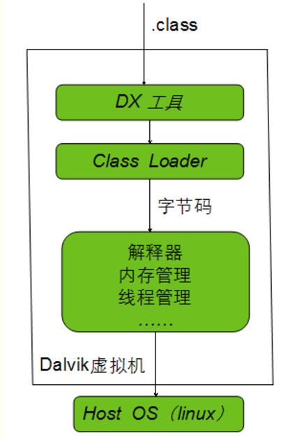

#### Android应用的编译以及运行流程
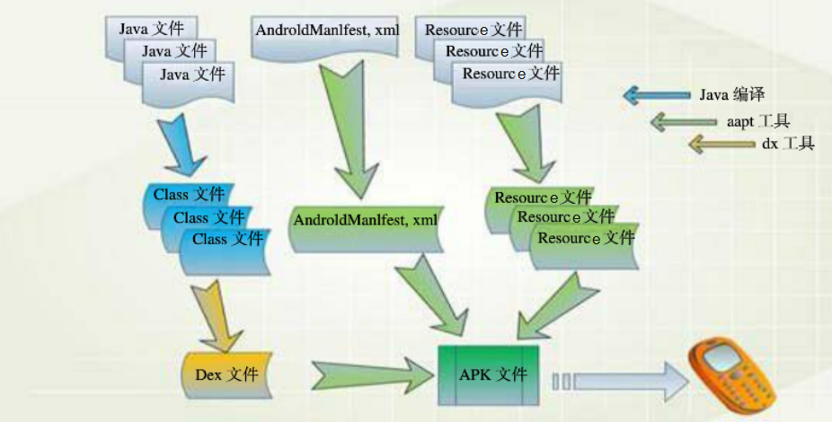
一个Android应用程序源码，需要经过如下步骤，才可以运行在Dalvik虚拟机中：
* 首先将Java代码编译成标准的Java字节码(.class文件)。
* 使用dx工具将class文件转换为.dex文件
* 使用aapt(Android Asset Packaging Tool)工具将Dex文件，Resource文件，Manifest文件组合成一个二进制的程序包（APK）。
* Dalvik将APK中的.dex文件提取出来进行优化，形成.odex文件，将APK文件安装在设备上。
* 运行该APP时，Dalvik将.odex文件翻译成机器码执行。
* Dalvik虚拟机直接翻译.odex文件并运行，如果应用包不发生变化，则.odex文件不会重新生成(每次APP重启，Dalvik都会把.odex翻译一遍才执行)。

#### Dalvik进程管理

(1)Zygote是一个虚拟机进程，同时也是一个虚拟机实例的孵化器。每当系统要求执行一个Android应用程序时，Zygote会fork出一个子进程来执行该程序。

(2)在JVM中，当虚拟机启动一个Java应用后，程序逻辑对于操作系统来说，是一个**单进程** 状态。虽然我们可以使用多线程模型，但是对于操作系统来说，这个多线程并不可见，这些线程是JVM模拟出来的，操作系统可见的只是一个单线程的进程。
Dalvik虚拟机中，每一个线程是对应Linux的线程，每一个进程对应一个Linux进程，进程和线程对操作系统可见。

(3)Dalvik进程模型
Zygote在使用fork机制时有三种不同的方式，分别是：
* `fork()` :  Fork一个普通的进程，该进程属于Zygote进程。

* `forkAndSpecialize()` ：Fork一个特殊的进程，该进程不再试Zygote进程。

* `forkSystemServer()`  ：Fork一个系统服务进程。

  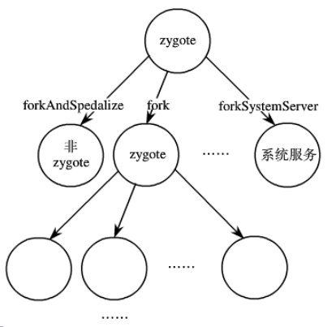


#### Dalvik内存管理
Dalvik的内存管理需要依赖Linux的内存管理机制，垃圾回收是采用了标记-清除法，使用标志位来标识内存中的对象是否正在使用。Dalvik是采用 **分离式的标志位方案**：


### ART -- Android Runtime
从Android4.4开始，Google使用ART替代了Dalvik虚拟机，Dalvik执行的是.dex字节码，ART虚拟机执行的是机器码。

#### 两种编译模式

* 即时编译技术(JIT：Just In Time)：JVM使用即时编译技术，javac把程序源码编译成Java字节码，JVM通过逐条解释字节码将其翻译成对应的机器指令，逐条读入，逐条翻译执行，这样的话，速度必然比C/C++编译后的可执行二进制字节码程序慢。
* 预编译技术(AOT : Ahead of Time)：应用程序再第一次安装的时候，字节码就会预先编译成**机器码** ,使之成为真正的本地应用，这样的话，应用每次启动和执行速度都会加快。

在Dalvik中，依靠JIT去编译执行，然后在运行的时候，动态地将执行频率很高的字节码翻译成本地机器码，然后再执行，但是dex字节码翻译成本地机器码的过程是在程序运行的过程中，并且应用程序每次重启，都要做这个翻译工作，效率低下。

应用在安装时，ART虚拟机就把应用程序安装包中的.odex字节码翻译成本地机器码，之后再次打开应用时，执行的都是本地机器码，因此执行效率更快，启动更快。

#### 打包安装运行简化流程
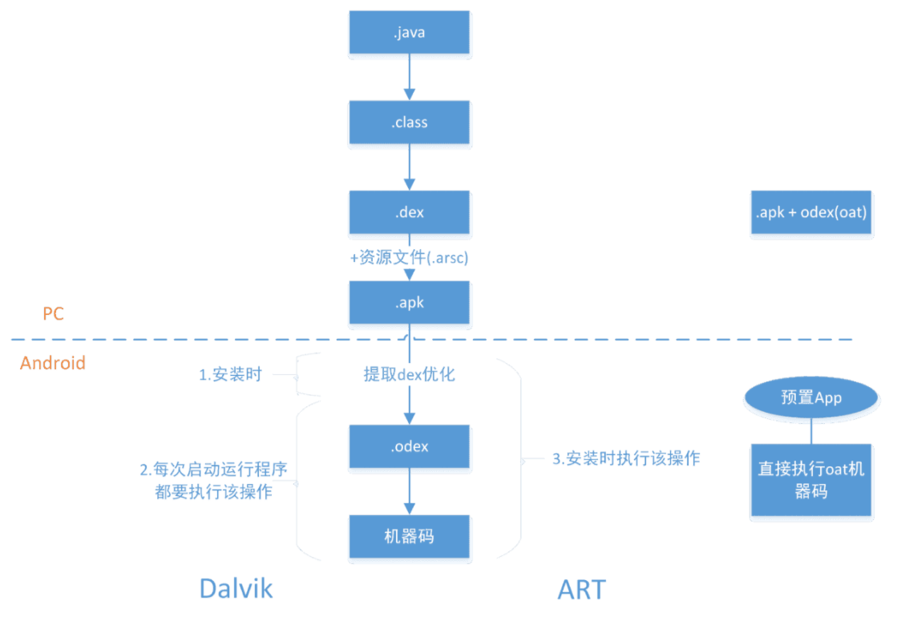

ART的优点
* 系统性能显著提升。
* 应用启动更快，运行更快。
* 支持更低的硬件。
* 续航更快。

ART的缺点
* 更大的存储空间，可能增加10-20%。（空间换时间）
* 更长的应用安装时间。


[回到目录](#index)

<h2 id="Android开机启动流程">Android开机启动流程</h2>

Android 开机过程可分为两个阶段，第一个阶段是Linux的启动，第二个阶段才是Android的启动。
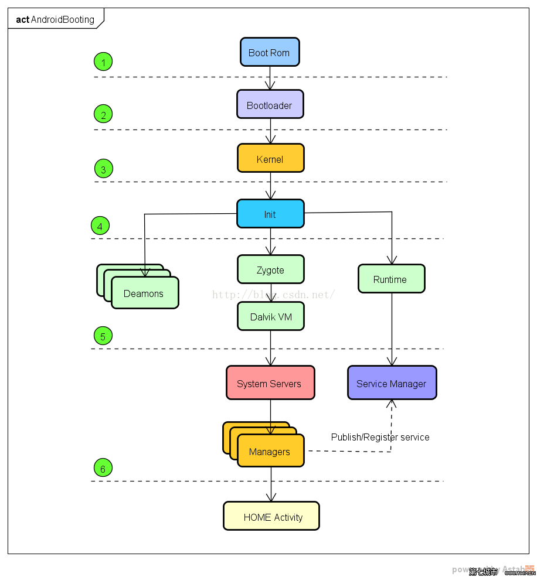

### 启动过程分析：
1. Boot Rom：当长按开机键时，引导芯片开始从固化在ROM的预设代码开始执行，然后加载引导程序到RAM。
2. BootLoader：又称引导程序，它是在操作系统运行的第一个程序，主要工作有检查RAM，初始化硬件参数等。
3. 初始化Kernel：在这个阶段中，初始化内核和各种设备驱动程序。
4. init进程：当初始化内核后，就会启动一个重要的进程，也就是**init进程** ，在Linux中所有的进程都是由init进程直接或间接fork出来的。init进程负责创建系统中最关键的几个子进程：SystemServer, Zygote和一些守护者进程(daemons)。
5. Zygote进程即是所有Android程序的父进程，在Zygote开启时，会调用如下`ZygoteInit.main()` 进行初始化：
```java
public static void main(String argv[]) {
    ....
    // 加载zygote的时候，会传入参数，startSystemServer变为true
     boolean startSystemServer = false;
     for (int i = 1; i < argv.length; i++) {
                if ("start-system-server".equals(argv[i])) {
                    startSystemServer = true;
                } else if (argv[i].startsWith(ABI_LIST_ARG)) {
                    abiList = argv[i].substring(ABI_LIST_ARG.length());
                } else if (argv[i].startsWith(SOCKET_NAME_ARG)) {
                    socketName = argv[i].substring(SOCKET_NAME_ARG.length());
                } else {
                    throw new RuntimeException("Unknown command line argument: " + argv[i]);
                }
            }
......
         // 启动的SystemServer进程
     if (startSystemServer) {
                startSystemServer(abiList, socketName);
         }
......
}

```

6. SystemServer 进程：在Zygote的`ZygoteInit.main()` 中，将标志位startSystemServer 设为true,即启动SystemServer 进程，即启动SystemServer进程，SystemServer进程中启动了一些系统里面重要的服务，如ActivityManagerService，WindowManager,DisplayManagerService,PackageManagerService等。当这些服务都启动完毕后，并注册到ServiceManager中。


7. Home Activity：即手机的"桌面"界面，当ActivityManagerService开启之后，会调用`finishBooting()`，同时发送广播`ACTION_BOOT_COMPLETED` 。

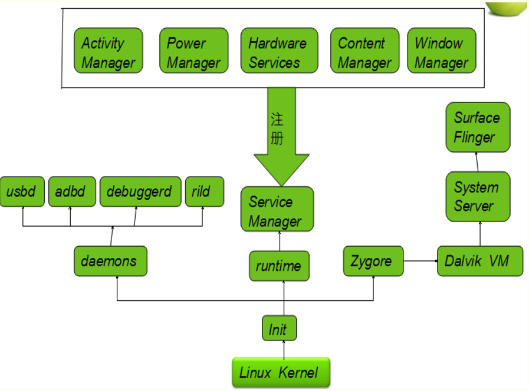

[回到目录](#index)


<h2 id="热修复">热修复</h2>  
代码修复有两大主要的方案，一类是阿里系的底层替换方案，另一类是腾讯系的类加载方案。

### 底层替换方案
底层替换方案是在已经加载了的类中直接替换掉原有方法，是在原来类的基础上进行修改的，因而无法实现对与原有类进行方法和字段的删减，因为这样会破坏原有类的结构。（只能进行方法的替换）
底层替换的不稳定性：一旦补丁类中出现了方法的增加或减少，就会导致这个类以及整个Dex的方法数发生变化，方法数的变化伴随着方法索引的变化，这样在访问方法时就无法正确地索引到目标方法了。如果字段发生了增加或减少，则所有字段的索引都会发生变化，那么对于原先已经产生的这个类的实例，他们还是原来的结构，这样在访问新增字段的时候就会出现错误。

### 类加载方案
类加载方案的原理是在APP重启后让ClassLoader去加载新的类，因为在APP运行到一半时，所有需要变更的类已经被加载过了，如果不重启，则原来的类还是虚拟机中，此时只有重启，重启后在还没有走到业务逻辑之前抢先加载补丁中的新类，这样后续访问这个类时，就会解析为新类，从而达到热修复的目的。

* 底层替换方案：限制颇多，但时效性好，加载轻快，立即见效。
* 类加载方案：时效性差，需要重新冷启动才能见效，但修复范围广，限制少。

### Sophix热修复方案
Sophix热修复方案综合使用了底层替换方案（热部署）、类加载方案（冷启动）、资源热修复、so库热修复：

#### 1.热部署——底层替换
**虚拟机调用方法的原理** ：
以ART虚拟机为例，每一个Java方法在ART中都对应着一个`ArtMethod` ，ArtMethod 记录了这个Java方法的所有信息，包括所属类，访问权限，代码执行地址等。
Android6.0中，ART虚拟机中的ArtMethod是这样的：
```
class ArtMethod FINAL{
    protected :

    GcRoot<mirror::Class > declaring_class_;
    GcRoot<mirror::PointerArray> dex_cache_resolved_methods_;
    GcRoot<mirror::ObjectArray<mirror::Class> dex_cache_resolved_types_;
    uint32_t access_flags;
    uint32_t dex_method_index;
    uint32_t method_index;

    struct PACKED(4) ptrSizedFields{
        void* entry_point_from_interpreter_;
        void* entry_point_from_jni_;
        void* entry_point_from_quick_compiled_code_;
    }ptr_sized_fields_;
}

```

其中重要的是`entry_point_from_interpreter_` 和`entry_point_from_quick_compiled_code_`  ，它们都指向方法的执行入口，如果是以JIT(即时解释执行)模式的虚拟机，则`entry_point_from_interpreter_` 就是方法的执行地址。如果是以AOT模式的虚拟机，dex文件会被预先编译成机器码，则`entry_point_from_quick_compiled_code_` 就是方法的执行地址。

AndFix底层替换方案是按照开源Android代码中的ArtMethod进行逐个方法替换的，当手机厂商对开源Android中的ArtMethod进行了更改时，逐个方法替换就会造成索引偏移不正确，从而引发在机型适配上的热修复失败的问题。
Sophix采用了对ArtMethod整体替换。使用新的ArtMethod对旧的进行整体替换，从而可以无视底层ArtMethod的结构。


### 2.冷启动——类加载
Dalvik和ART尝试将一个dex文件解析加载到内存时，调用了`DexFile.loadDex()` 方法。
1. Dalvik尝试把dex文件加载到内存时，如果此时压缩包中有多个dex文件，则只会加载**classes.dex** ， 之外的其他dex被直接忽略掉。（Dalvik只能加载一个classes.dex，不支持多dex）
2. ART可以支持加载多个dex文件，当ART会首先加载classes.dex ，如果有其他的dex文件，则再依次加载后续的classes.dex 。所以ART下的冷启动修复方案是：把补丁包命名为classes.dex，将原apk中的dex依次命名为classes2.dex,classes3.dex等等，然后一起打包为一个压缩文件。在DexFile.loadDex得到DexFile对象，最后把该DexFile对象整个替换掉旧的dexElements数组。补丁类是存在于classes.dex中，当而旧的类(bug类)是存在于其他的classes.dex中，当先加载了classes.dex后，由于内存中已经有这个类了，后面便不再加载旧的bug类，从而达到修复的目的。
3. 无论是Dalvik还是ART，当虚拟机将dex文件加载到内存之前，如果dex不存在对应的odex，那么Dalvik会执行`dexopt` ，ART会执行`dexoat` ，最后得到的是一个优化后的dex——odex，实际上虚拟机执行的是odex。

Sophix的最终处理是：
* Dalvik下采用了自行研发的全量dex方案。
* ART下把补丁dex作为主dex文件(classes.dex)，进行先加载。

### 3.资源热修复
Instant Run 中的资源热修复：
* 首先构造一个新的AssetManager，并通过反射调用addAssetPath，把这个完整的新资源包加入到AssetManager中，这样就得到了一个含有所有资源的AssetManager。
* 通过反射得到Activity中的AssetManager的引用处，全部换成新的AssetManager。

APK中的资源实际上是存储在底层AssetManager的mResources成员中，mResources成员是一个ResTable类：
```
class ResTable{
    mutable Mutex     mLock;//互斥锁，用于多进程间访问互斥
    status_t                mError;
    resTable_config     mParams;
    Vector<Header*>     mHeaders;//表示所有resources.arsc原始数据，这就等同于所有通过addAssetPath加
                                                        //载进来的路径资源id信息
    Vector<PackageGroup*> mPackageGroups;//资源包的实体，包含所有加载进来的package id所对应的资源
    uint8_t                 mPackageMaps;//索引表
    uint9_t                 mNextPackageId;
};
```
一个Android进程只包含一个ResTable，ResTable的成员变量mPackageGroups就是所有解析过的资源包的集合，任何一个一个资源包都含有resources.arsc，它记录了所有资源id分配情况和资源中的所有字符串，这些信息是以二进制的方式存储的。底层AssetManager 做的就是解析这个文件，然后把相关信息存储到mPackageGroups里面。

一个resources.arsc里面包含若干个package，默认情况下，由打包工具aapt打出来的包只有一个package，这个package里包含了app中的所有资源信息。资源信息主要是指每个资源的名称和它对应的编号。编号是一个32位的int型，用16进制表示就是0xPPTTEEEE，PP为package id,TT为type id，EEEE为entry id。`type id` 是指资源的类型，如attr的type id为1，drawable的type id 为2,mipmap的type id 为3，layout的type id 为4等。entry id代表在一类资源中，资源文件的id索引。如layout类型，第一个layout的entry id 为0x0000，第二个layout为0x0001，依次类推（这个entry id是根据排布顺序决定的）。


由aapt工具打包后，APP中资源包的package id 为**0x7f**，系统的资源包的package id为**0x01** 。

**Sophix的资源修复原理** ：
构造了一个package id 为`0x66` 的资源包，这个包里只包含已改变的资源项，然后在原有AssetManager中`addAssetPath` 这个包。新增的资源包不与已加载的`0x7f` 冲突，因此直接加入到已有的AssetManager中就可以直接使用了。

### 4.so库修复
Java Api提供了两种方法加载一个so库：
* System.loadLibrary(String libName):传进去的参数是so库名称，默认是表示so库位于apk压缩文件的libs目录，最后复制到apk安装目录下。
* System.load(String pathName):传进去的参数是so库在磁盘中的完整路径，表示加载一个外部的so库文件。

上面两种方法实际上都调用了`nativeLoad()`这个native方法去加载so库。

JNI编程中，动态注册的native方法必须要实现`JNI_OnLoad` 方法，同时实现一个JNINativeMethod[]数组，静态注册的native方法必须使**Java_类完整路径_方法名的格式** 。

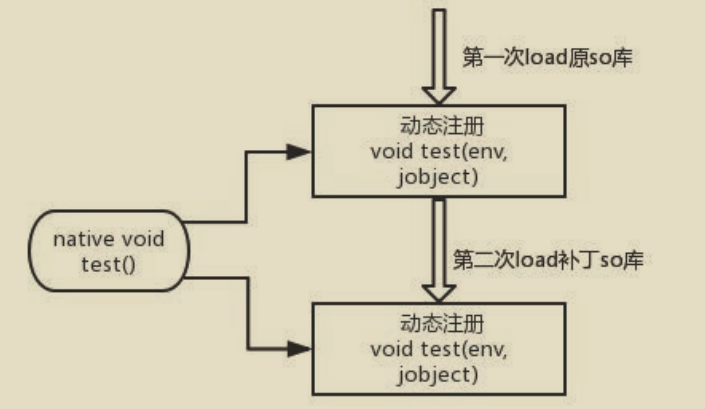

由于so库热部署实现起来约束多，于是Sophix团队放弃了So库的热部署。Sophix对于so库的修复是采取了冷启动修复的方式：

Sophix采用的反射注入方案：
在`System.loadLibrary("native-lib")` 函数中，最终这个so库最终传给native方法的执行参数是**so库在磁盘中的完整路径** 。so库的路径搜索是调用`DexPathList` 的`findLibrary()` 函数：
```java
//这是sdk<23的实现方式
private final File[] nativeLibraryDirectories;
public String findLibrary(String libraryName){
    String fileName = System.mapLibraryName(libraryName);
    for(File directory : nativeLibraryDirectories){
        String path = new File(directory,fileName).getPath();
        if(IoUtils.canOpenReadOnly(path)){
                //如果path文件存在并且可以打开，则返回该路径
                return path;
        }
    }
    return null;
}
```
实际上寻找so库是遍历`nativeLibraryDirectories` 数组，而只要将补丁so库路径插入到`nativeLibraryDirectories` 数组最前面，这样就能达到加载so库的时候是补丁so库而不是原来so库的目录，从而达到修复的目的。

```java
//这是sdk>=23的实现方式
private final Element[] nativeLibraryElements;
public String findLibrary(String libraryName){
    String fileName = System.mapLibraryName(libraryName);
    for(Element element : nativeLibraryElements){
        String path = new File(directory,fileName).getPath();
        if(IoUtils.canOpenReadOnly(path)){
                //如果path文件存在并且可以打开，则返回该路径
                if(path != null){
                    return path;
                }
        }
    }
    return null;
}
```
当sdk>=23时，只要把补丁so库的完整路径作为参数构造一个`Element` 对象，然后再插入到nativeLibraryElements数组最前面就可以达到修复的目的。

 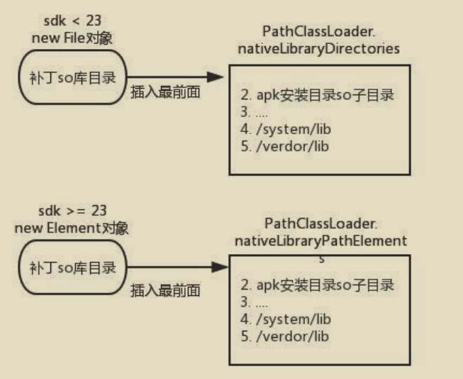

[回到目录](#index)
