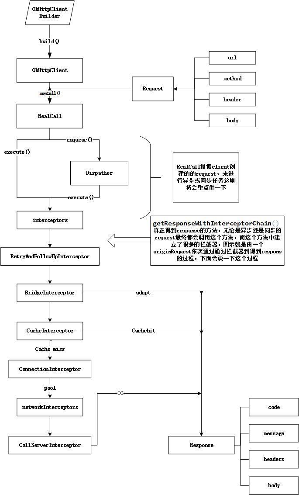

# OkHttp源码阅读

>基于OkHttp v-3.6.0

OkHttp整体执行流程是：通过`OkHttpClient` 将构建的`Request` 转换为Call，然后在`RealCall` 中进行异步或同步任务，最后通过一些拦截器`Interceptor`发出网络请求，最后得到返回的`Response` ，如果是异步请求，设置了回调之后会触发`onResponse()` 或`onFailure()`。



## 同步的Get请求
一个Get请求的示例：
```java
public String get(String url) throws IOException {
       OkHttpClient client = new OkHttpClient();
       Request request = new Request.Builder()
               .url(url)
               .get()
               .build();
       Response response = client.newCall(request).execute();
       if (response.isSuccessful()) {
           return response.body().string();
       }else{
           throw new IOException("unexpected Code:" + response.code());
       }
   }
```

OkHttpClient 中有一个静态内部类`Builder`，该`Builder` 的成员变量如下：

```java
    final Dispatcher dispatcher;  //分发器
    final Proxy proxy;  //代理
    final List<Protocol> protocols; //协议
    final List<ConnectionSpec> connectionSpecs; //传输层版本和连接协议
    final List<Interceptor> interceptors; //拦截器
    final List<Interceptor> networkInterceptors; //网络拦截器
    final ProxySelector proxySelector; //代理选择
    final CookieJar cookieJar; //cookie
    final Cache cache; //缓存
    final InternalCache internalCache;  //内部缓存
    final SocketFactory socketFactory;  //socket 工厂
    final SSLSocketFactory sslSocketFactory; //安全套接层socket 工厂，用于HTTPS
    final CertificateChainCleaner certificateChainCleaner; // 验证确认响应证书 适用 HTTPS 请求连接的主机名。
    final HostnameVerifier hostnameVerifier;    //  主机名字确认
    final CertificatePinner certificatePinner;  //  证书链
    final Authenticator proxyAuthenticator;     //代理身份验证
    final Authenticator authenticator;      // 本地身份验证
    final ConnectionPool connectionPool;    //连接池,复用连接
    final Dns dns;  //域名
    final boolean followSslRedirects;  //安全套接层重定向
    final boolean followRedirects;  //本地重定向
    final boolean retryOnConnectionFailure; //重试连接失败
    final int connectTimeout;    //连接超时
    final int readTimeout; //read 超时
    final int writeTimeout; //write 超时
    final int pingInterval;//Ping间隔
```

`OkHttpClient` 中也有这些成员变量，当使用`new OkHttpClient(Builder builder )` 的构造函数时，OkHttpClient中的这些成员变量将由Builder传进去。

这些成员变量都有默认的值：
```java
public Builder() {
      dispatcher = new Dispatcher();
      protocols = DEFAULT_PROTOCOLS;
      connectionSpecs = DEFAULT_CONNECTION_SPECS;
      proxySelector = ProxySelector.getDefault();
      cookieJar = CookieJar.NO_COOKIES;
      socketFactory = SocketFactory.getDefault();
      hostnameVerifier = OkHostnameVerifier.INSTANCE;
      certificatePinner = CertificatePinner.DEFAULT;
      proxyAuthenticator = Authenticator.NONE;
      authenticator = Authenticator.NONE;
      connectionPool = new ConnectionPool();
      dns = Dns.SYSTEM;
      followSslRedirects = true;
      followRedirects = true;
      retryOnConnectionFailure = true;
      connectTimeout = 10_000;
      readTimeout = 10_000;
      writeTimeout = 10_000;
      pingInterval = 0;
    }
```

执行请求时，调用了`OkHttpClient` 的`newCall()` 方法。

```java
@Override public Call newCall(Request request) {
    return new RealCall(this, request, false /* for web socket */);
  }
 ```

 ## RealCall : 请求执行者
构造方法：
```java
RealCall(OkHttpClient client, Request originalRequest, boolean forWebSocket) {
    this.client = client;
    this.originalRequest = originalRequest;
    this.forWebSocket = forWebSocket;
    this.retryAndFollowUpInterceptor = new RetryAndFollowUpInterceptor(client, forWebSocket);
  }
 ```
 Call的`execute()` (同步)方法：
 ```java
 @Override public Response execute() throws IOException {
    synchronized (this) {
      if (executed) throw new IllegalStateException("Already Executed");
      executed = true;
    }
    captureCallStackTrace();
    try {
        //实际上调用了dispatcher的execute()方法
      client.dispatcher().executed(this);
      Response result = getResponseWithInterceptorChain();
      if (result == null) throw new IOException("Canceled");
      return result;
    } finally {
      client.dispatcher().finished(this);
    }
  }
  ```
  `execute()` 方法的执行过程为：
  * 检查这个call是否已经被执行过了，每个call只能被执行一次，如果想再次执行call，则可以利用`clone` 方法来克隆。
  * 利用`client.dispatcher().execute(this)` 来进行实际的执行，`dispatcher` 就是OkHttpClient的成员之一。
  * 调用`getResponseWithInterceptorChain()` 来获取HTTP返回结果，在这个函数内部还会进行一系列的“拦截” 操作。
  * 最后调用dispatcher的`finished(this)` ，表示已执行完毕。

真正发起网络请求并返回结果的是`getResponseWithInterceptorChain` :
```java
//拦截器的责任链
Response getResponseWithInterceptorChain() throws IOException {
    // Build a full stack of interceptors.
    List<Interceptor> interceptors = new ArrayList<>();
    interceptors.addAll(client.interceptors());//(1)
    interceptors.add(retryAndFollowUpInterceptor);//(2)
    interceptors.add(new BridgeInterceptor(client.cookieJar()));//(3)
    interceptors.add(new CacheInterceptor(client.internalCache()));//(4)
    interceptors.add(new ConnectInterceptor(client));//(5)
    if (!forWebSocket) {
      interceptors.addAll(client.networkInterceptors());//(6)
    }
    interceptors.add(new CallServerInterceptor(forWebSocket));//(7)

    Interceptor.Chain chain = new RealInterceptorChain(
        interceptors, null, null, null, 0, originalRequest);
    return chain.proceed(originalRequest);//(8)
  }
 ```
 (1) 将配置OkHttpClient时的拦截器加入到责任链中。

 (2) 负责失败重试以及重定向的拦截器`RetryAndFollowUpInterceptor` 。

 (3)负责把用户构造的请求转换为发送到服务器的请求，把服务器返回的响应转换为Response。

 (4)负责读取缓存或更新缓存的`CacheInterceptor` 。

 (5)负责和服务器建立连接的ConnectionIntercaptor。

 (6)配置OkHttpClient时设置的网络层的拦截器。

 (7)负责向服务器发送请求数据，从服务器读取响应数据的`CallServerInterceptor` 。

 (8)调用`chain.proceed(originRequest)` 中开启责任链调用。

## RealInterceptorChain
`RealInterceptorChain` 的`proceed(Request request)` 如下：
```java
@Override public Response proceed(Request request) throws IOException {
   return proceed(request, streamAllocation, httpCodec, connection);
 }

 public Response proceed(Request request, StreamAllocation streamAllocation, HttpCodec httpCodec,
     Connection connection) throws IOException {
   if (index >= interceptors.size()) throw new AssertionError();

   calls++;

   //检查Requestt是否指向相同的URL和端口，如果不相同，则抛异常
   if (this.httpCodec != null && !sameConnection(request.url())) {
     throw new IllegalStateException("network interceptor " + interceptors.get(index - 1)
         + " must retain the same host and port");
   }

   //保证一个proceed() 只处理一个Call
   if (this.httpCodec != null && calls > 1) {
     throw new IllegalStateException("network interceptor " + interceptors.get(index - 1)
         + " must call proceed() exactly once");
   }
   //proceed中主要的执行工作：
   //调用责任链中的下一个拦截器
   RealInterceptorChain next = new RealInterceptorChain(
       interceptors, streamAllocation, httpCodec, connection, index + 1, request);//(1)
   Interceptor interceptor = interceptors.get(index);//(2)
   Response response = interceptor.intercept(next);//(3)

   //确保一个责任链只能调用一次proceed()
   if (httpCodec != null && index + 1 < interceptors.size() && next.calls != 1) {
     throw new IllegalStateException("network interceptor " + interceptor
         + " must call proceed() exactly once");
   }

   //确保响应不为Null
   if (response == null) {
     throw new NullPointerException("interceptor " + interceptor + " returned null");
   }
   return response;
 }
 ```
*  `RealInterceptorChain next = new RealInterceptorChain(
     interceptors, streamAllocation, httpCodec, connection, index + 1, request);` 实例化下一个拦截器对应的`RealInterceptorChain`对象，这个对象会在再次传递给当前的拦截器。
* `Interceptor interceptor = interceptors.get(index);` ：从ArrayList中获取当前的拦截器。
* `Response response = interceptor.intercept(next);` :调用当前拦截器的`intercept()` 方法，并将下一个拦截器的`RealInterceptorChain` 对象传递下去。

## 分析各个拦截器的`intercept()` 方法

### RetryAndFollowUpInterceptor
在 `getResponseWithInterceptorChain()` 中，会首先将`RetryAndFollowUpInterceptor` 加入到ArrayList中，首先加入List的拦截器的`intercept()` 方法当然会先调用。

`RetryAndFollowUpInterceptor` 的`intercept()` 方法：
```java
@Override public Response intercept(Chain chain) throws IOException {
    Request request = chain.request();

    streamAllocation = new StreamAllocation(
        client.connectionPool(), createAddress(request.url()), callStackTrace);

    int followUpCount = 0;
    Response priorResponse = null;
    while (true) {
      if (canceled) {
        streamAllocation.release();
        throw new IOException("Canceled");
      }

      Response response = null;
      boolean releaseConnection = true;
      try {
        //这里同样是调用了RealInterceptorChain的proceed()
        response = ((RealInterceptorChain) chain).proceed(request, streamAllocation, null, null);
        releaseConnection = false;
      } catch (RouteException e) {
        //如果上一次连接失败并且是不可恢复异常，则continue
        if (!recover(e.getLastConnectException(), false, request)) {
          throw e.getLastConnectException();
        }
        releaseConnection = false;
        continue;
      } catch (IOException e) {
        //如果连接服务器失败，则并不释放连接，下一轮循环再次尝试连接
        boolean requestSendStarted = !(e instanceof ConnectionShutdownException);
        if (!recover(e, requestSendStarted, request)) throw e;
        releaseConnection = false;
        continue;
      } finally {
        //如果捕获到未检查的异常，终止连接，释放资源
        if (releaseConnection) {
          streamAllocation.streamFailed(null);
          streamAllocation.release();
        }
      }

      //附上先前的response，构造一个新的合成的response
      if (priorResponse != null) {
        response = response.newBuilder()
            .priorResponse(priorResponse.newBuilder()
                    .body(null)
                    .build())
            .build();
      }
      //判断这里是否需要进行跟进请求，如添加认证头信息，重定向，超时等，
      //如果这里不需要进行跟进请求，则返回null
      Request followUp = followUpRequest(response);

      if (followUp == null) {
        if (!forWebSocket) {
          streamAllocation.release();
        }
        //如果不需要进行跟进请求，则这里直接返回response
        return response;
      }

      closeQuietly(response.body());

      if (++followUpCount > MAX_FOLLOW_UPS) {
        streamAllocation.release();
        throw new ProtocolException("Too many follow-up requests: " + followUpCount);
      }

      if (followUp.body() instanceof UnrepeatableRequestBody) {
        streamAllocation.release();
        throw new HttpRetryException("Cannot retry streamed HTTP body", response.code());
      }

      if (!sameConnection(response, followUp.url())) {
        streamAllocation.release();
        streamAllocation = new StreamAllocation(
            client.connectionPool(), createAddress(followUp.url()), callStackTrace);
      } else if (streamAllocation.codec() != null) {
        throw new IllegalStateException("Closing the body of " + response
            + " didn't close its backing stream. Bad interceptor?");
      }

      request = followUp;
      priorResponse = response;
    }
  }
 ```

 ### BridgeInterceptor
 负责把用户构造的请求转换为发送到服务器的请求、把服务器返回的响应转换为用户友好的响应的 。
 ```java
 @Override public Response intercept(Chain chain) throws IOException {
    Request userRequest = chain.request();
    Request.Builder requestBuilder = userRequest.newBuilder();

    RequestBody body = userRequest.body();
    //检查request，将用户的request转换为发送到server的request
    //实际上也就是默认添加了一些请求头信息
    if (body != null) {
      MediaType contentType = body.contentType();
      if (contentType != null) {
        requestBuilder.header("Content-Type", contentType.toString());
      }

      long contentLength = body.contentLength();
      if (contentLength != -1) {
        requestBuilder.header("Content-Length", Long.toString(contentLength));
        requestBuilder.removeHeader("Transfer-Encoding");
      } else {
        requestBuilder.header("Transfer-Encoding", "chunked");
        requestBuilder.removeHeader("Content-Length");
      }
    }

    if (userRequest.header("Host") == null) {
      requestBuilder.header("Host", hostHeader(userRequest.url(), false));
    }

    if (userRequest.header("Connection") == null) {
      requestBuilder.header("Connection", "Keep-Alive");
    }

    //如果增加了 "Accept-Encoding: gzip"请求头，则需要进行解压缩
    boolean transparentGzip = false;
    if (userRequest.header("Accept-Encoding") == null && userRequest.header("Range") == null) {
      transparentGzip = true;
      requestBuilder.header("Accept-Encoding", "gzip");
    }

    List<Cookie> cookies = cookieJar.loadForRequest(userRequest.url());
    if (!cookies.isEmpty()) {
      requestBuilder.header("Cookie", cookieHeader(cookies));
    }

    if (userRequest.header("User-Agent") == null) {
      requestBuilder.header("User-Agent", Version.userAgent());
    }
    //核心也是调用了chain的proceed方法获取Response
    Response networkResponse = chain.proceed(requestBuilder.build());

    HttpHeaders.receiveHeaders(cookieJar, userRequest.url(), networkResponse.headers());

    Response.Builder responseBuilder = networkResponse.newBuilder()
        .request(userRequest);

    if (transparentGzip
        && "gzip".equalsIgnoreCase(networkResponse.header("Content-Encoding"))
        && HttpHeaders.hasBody(networkResponse)) {
      GzipSource responseBody = new GzipSource(networkResponse.body().source());
      Headers strippedHeaders = networkResponse.headers().newBuilder()
          .removeAll("Content-Encoding")
          .removeAll("Content-Length")
          .build();
      responseBuilder.headers(strippedHeaders);
      responseBuilder.body(new RealResponseBody(strippedHeaders, Okio.buffer(responseBody)));
    }
    //利用从chain.proceed()中得到的Response，构建一个新的response对象返回
    return responseBuilder.build();
  }
  ```

  ### CacheInterceptor
  用来进行缓存的拦截器
  ```java
  @Override public Response intercept(Chain chain) throws IOException {
    //通过request得到一个Respose对象，用作缓存的
    Response cacheCandidate = cache != null
        ? cache.get(chain.request())
        : null;

    long now = System.currentTimeMillis();

    CacheStrategy strategy = new CacheStrategy.Factory(now, chain.request(), cacheCandidate).get();
    Request networkRequest = strategy.networkRequest;
    Response cacheResponse = strategy.cacheResponse;

    if (cache != null) {
      cache.trackResponse(strategy);
    }

    if (cacheCandidate != null && cacheResponse == null) {
        //如果已经存在缓存，则关闭
      closeQuietly(cacheCandidate.body());
    }

    //如果禁止了网络，且缓存为null,则这次请求失败
    if (networkRequest == null && cacheResponse == null) {
      return new Response.Builder()
          .request(chain.request())
          .protocol(Protocol.HTTP_1_1)
          .code(504)
          .message("Unsatisfiable Request (only-if-cached)")
          .body(Util.EMPTY_RESPONSE)
          .sentRequestAtMillis(-1L)
          .receivedResponseAtMillis(System.currentTimeMillis())
          .build();
    }

    //如果没必要使用网络，即缓存可以满足请求，则返回缓存
    if (networkRequest == null) {
      return cacheResponse.newBuilder()
          .cacheResponse(stripBody(cacheResponse))
          .build();
    }

    Response networkResponse = null;
    try {
      networkResponse = chain.proceed(networkRequest);
    } finally {
      //如果已经存在缓存了，则cacheCandidate就可以释放了
      if (networkResponse == null && cacheCandidate != null) {
        closeQuietly(cacheCandidate.body());
      }
    }


    //如果有缓存体，则选择性的返回这个缓存体，请求成功则返回这个缓存体，请求失败则不返回
    if (cacheResponse != null) {
      if (networkResponse.code() == HTTP_NOT_MODIFIED) {
        Response response = cacheResponse.newBuilder()
            .headers(combine(cacheResponse.headers(), networkResponse.headers()))
            .sentRequestAtMillis(networkResponse.sentRequestAtMillis())
            .receivedResponseAtMillis(networkResponse.receivedResponseAtMillis())
            .cacheResponse(stripBody(cacheResponse))
            .networkResponse(stripBody(networkResponse))
            .build();
        networkResponse.body().close();

        //在剥离content-coding之前，更新缓存
        cache.trackConditionalCacheHit();
        cache.update(cacheResponse, response);
        return response;
      } else {
        closeQuietly(cacheResponse.body());
      }
    }

    Response response = networkResponse.newBuilder()
        .cacheResponse(stripBody(cacheResponse))
        .networkResponse(stripBody(networkResponse))
        .build();

    if (HttpHeaders.hasBody(response)) {
      CacheRequest cacheRequest = maybeCache(response, networkResponse.request(), cache);
      response = cacheWritingResponse(cacheRequest, response);
    }

    return response;
  }
  ```
整个关于缓存的拦截器做的工作：
* 首先，根据request来判断cache中是否有缓存的response，如果有，得到这个response，然后进行判断当前response是否有效，没有将cacheCandate赋值为空。
* 根据request判断缓存的策略，是否要使用了网络，缓存 或两者都使用
调用下一个拦截器，决定从网络上来得到response
* 如果本地已经存在cacheResponse，那么让它和网络得到的networkResponse做比较，决定是否来更新缓存的cacheResponse
* 缓存未经缓存过的response

### ConnectInterceptor
ConnectInterceptor是用来建立连接的。
```java
@Override public Response intercept(Chain chain) throws IOException {
    RealInterceptorChain realChain = (RealInterceptorChain) chain;
    Request request = realChain.request();
    StreamAllocation streamAllocation = realChain.streamAllocation();

    //如果请求方法不是Get，则要对目标网络(url)进行验证，看看是否是正常的连接，比如，向一个只接受Get请求的URL发起POST请求，这就可能导致一个非正常的连接
    boolean doExtensiveHealthChecks = !request.method().equals("GET");
    HttpCodec httpCodec = streamAllocation.newStream(client, doExtensiveHealthChecks);
    RealConnection connection = streamAllocation.connection();

    return realChain.proceed(request, streamAllocation, httpCodec, connection);
  }
 ```
 实际就是创建了`HttpCodec` 对象，它是对HTTP协议的抽象，它有两个实现，`Http1Codec` 和`Http2Code` ，分别对应HTTP/1.1和HTTP/2版本的实现。

在Http1Codec 中，它利用Okio对Socket的读写操作进行封装，Okio对java.io和java.nio进行了更便捷高效的封装，方便使用者进行高效的io操作。

### NetworkInterceptors
配置OkHttpClient时自定义的`NetworkInterceptors` ，这是网络层拦截器，`intercept` 方法需要开发者进行实现。

### CallServerInterceptor
`CallServerInterceptor` 这是责任链的最后一个拦截器，是用来对服务器发起真正的请求。
```java
@Override public Response intercept(Chain chain) throws IOException {
    HttpCodec httpCodec = ((RealInterceptorChain) chain).httpStream();
    StreamAllocation streamAllocation = ((RealInterceptorChain) chain).streamAllocation();
    Request request = chain.request();

    long sentRequestMillis = System.currentTimeMillis();
    httpCodec.writeRequestHeaders(request);

    Response.Builder responseBuilder = null;
    if (HttpMethod.permitsRequestBody(request.method()) && request.body() != null) {
      //当POST请求时，数据量大于1024(1k)时，100 Continue表明请求一次没发送完，需要继续发送。
      if ("100-continue".equalsIgnoreCase(request.header("Expect"))) {
        httpCodec.flushRequest();
        responseBuilder = httpCodec.readResponseHeaders(true);
      }

      //通过BufferedSink来保存数据
      if (responseBuilder == null) {
        Sink requestBodyOut = httpCodec.createRequestBody(request, request.body().contentLength());
        BufferedSink bufferedRequestBody = Okio.buffer(requestBodyOut);
        request.body().writeTo(bufferedRequestBody);
        bufferedRequestBody.close();
      }
    }

    httpCodec.finishRequest();

    if (responseBuilder == null) {
      responseBuilder = httpCodec.readResponseHeaders(false);
    }

    Response response = responseBuilder
        .request(request)
        .handshake(streamAllocation.connection().handshake())
        .sentRequestAtMillis(sentRequestMillis)
        .receivedResponseAtMillis(System.currentTimeMillis())
        .build();

    int code = response.code();
    if (forWebSocket && code == 101) {
      // Connection is upgrading, but we need to ensure interceptors see a non-null response body.
      response = response.newBuilder()
          .body(Util.EMPTY_RESPONSE)
          .build();
    } else {
      response = response.newBuilder()
          .body(httpCodec.openResponseBody(response))
          .build();
    }

    if ("close".equalsIgnoreCase(response.request().header("Connection"))
        || "close".equalsIgnoreCase(response.header("Connection"))) {
      streamAllocation.noNewStreams();
    }

    if ((code == 204 || code == 205) && response.body().contentLength() > 0) {
      throw new ProtocolException(
          "HTTP " + code + " had non-zero Content-Length: " + response.body().contentLength());
    }

    return response;
  }
 ```
OkHttp的拦截器用了责任链设计模式,它将请求一层一层向下传，直到有一层能够得到Response就停止向下传递，然后将response向上面的拦截器传递，然后各个拦截器会对respone进行一些处理，最后会传到RealCall类中来得到response。由于`execute` 是同步方法，因此不需要设置回调。


## 异步的Get请求
一个异步Get请求的示例：
```java
private final OkHttpClient client = new OkHttpClient();

  public void run() throws Exception {
    Request request = new Request.Builder()
        .url("http://publicobject.com/helloworld.txt")
        .build();

    client.newCall(request).enqueue(new Callback() {
      @Override
      public void onFailure(Call call, IOException e) {
        e.printStackTrace();
      }

      @Override
      public void onResponse(Call call, Response response) throws IOException {
        if (!response.isSuccessful()) throw new IOException("Unexpected code " + response);

        Headers responseHeaders = response.headers();
        for (int i = 0, size = responseHeaders.size(); i < size; i++) {
          System.out.println(responseHeaders.name(i) + ": " + responseHeaders.value(i));
        }

        System.out.println(response.body().string());
      }
    });
  }
```
前面的分析可知，`newCall()`返回的是一个`RealCall` 对象，下面是`RealCall` 的`enque()` 方法：
```java
@Override public void enqueue(Callback responseCallback) {
   synchronized (this) {
     if (executed) throw new IllegalStateException("Already Executed");
     executed = true;
   }
   captureCallStackTrace();
   client.dispatcher().enqueue(new AsyncCall(responseCallback));
 }
 ```
如果`execute` 为true，表示已经执行过了，则会抛异常。
如果没有执行过，则调用`captureCallStackTrace()` :
```java
private void captureCallStackTrace() {
    //调用该方法，获取一个方法栈对象
    Object callStackTrace = Platform.get().getStackTraceForCloseable("response.body().close()");
    //给这个retryAndFollowUpInterceptor拦截器设置方法栈
    retryAndFollowUpInterceptor.setCallStackTrace(callStackTrace);
  }
 ```
 dispatcher的`enqueue()`方法 ：
 ```java
 synchronized void enqueue(AsyncCall call) {
   if (runningAsyncCalls.size() < maxRequests && runningCallsForHost(call) < maxRequestsPerHost) {
     runningAsyncCalls.add(call);
     executorService().execute(call);
   } else {
     readyAsyncCalls.add(call);
   }
 }
 ```
 如果正在运行的异步任务小于最大的请求限制，且`runningCallsForHost`的数量小于`maxRequestsPerHost` (?这个是什么，还不理解)，则将call加入到`runningAsyncCalls`中执行，同时利用线程池执行call。
 这个`AsyncCall` 是RealCall的内部类，这个`AsyncCall` 也是一`Runnable` 对象,其中包含了`Callback`回调接口：
 ```java
 final class AsyncCall extends NamedRunnable {
    private final Callback responseCallback;
    //这个构造函数中传进去的是整个请求的回调
    AsyncCall(Callback responseCallback) {
      super("OkHttp %s", redactedUrl());
      this.responseCallback = responseCallback;
    }

    String host() {
      return originalRequest.url().host();
    }

    Request request() {
      return originalRequest;
    }

    RealCall get() {
      return RealCall.this;
    }
    //当执行Runnable的run时，实际上就是执行这个execute方法，因为这个execute被封装在NamedRunnable的run方法中了
    @Override protected void execute() {
      boolean signalledCallback = false;
      try {
        Response response = getResponseWithInterceptorChain();
        if (retryAndFollowUpInterceptor.isCanceled()) {
          signalledCallback = true;
          responseCallback.onFailure(RealCall.this, new IOException("Canceled"));
        } else {
          signalledCallback = true;
          responseCallback.onResponse(RealCall.this, response);
        }
      } catch (IOException e) {
        if (signalledCallback) {
          // Do not signal the callback twice!
          Platform.get().log(INFO, "Callback failure for " + toLoggableString(), e);
        } else {
          responseCallback.onFailure(RealCall.this, e);
        }
      } finally {
        client.dispatcher().finished(this);
      }
    }
  }
```    
而`Callback`就是我们在执行`enqueue()`时传进入的回调。`Callback` 接口如下：
```java
public interface Callback {
  /**
   * Called when the request could not be executed due to cancellation, a connectivity problem or
   * timeout. Because networks can fail during an exchange, it is possible that the remote server
   * accepted the request before the failure.
   */
  void onFailure(Call call, IOException e);

  /**
   * Called when the HTTP response was successfully returned by the remote server. The callback may
   * proceed to read the response body with {@link Response#body}. The response is still live until
   * its response body is {@linkplain ResponseBody closed}. The recipient of the callback may
   * consume the response body on another thread.
   *
   * <p>Note that transport-layer success (receiving a HTTP response code, headers and body) does
   * not necessarily indicate application-layer success: {@code response} may still indicate an
   * unhappy HTTP response code like 404 or 500.
   */
  void onResponse(Call call, Response response) throws IOException;
}
```
当调用` executorService().execute(call);`方法时，会执行call的`execute()` 方法，同样是通过`Response response = getResponseWithInterceptorChain();` 来执行下面的逻辑，这就是转到责任链中去了，下面的步骤和同步Get请求的执行流程一样了。。如果请求和响应正常最后返回一个`Response`对象。

得到`Response` 或者出错之后，就会触发回调`onResponse(Call call, Response response)` 或者`onFailure(Call call, IOException e)` 。

至此，整个OkHttp的Get同步和异步请求的过程就分析完了。。。

--------------2017.7.3  20:39--------------------
