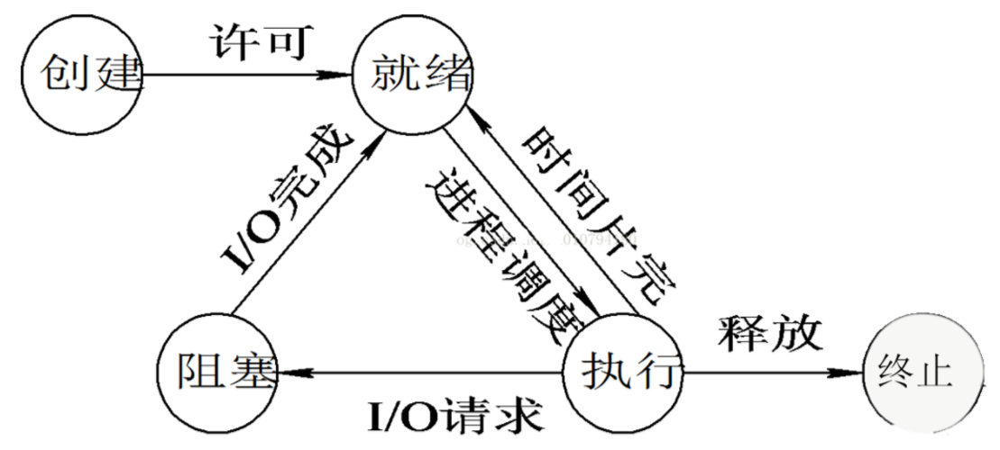

# 操作系统面试考点归纳

## 操作系统的主要功能

处理机管理：处理机分配都是以进程为单位，所以处理机管理也被看做是进程管理。包括进程控制，进程同步，进程通信和进程调度。
内存管理：内存分配，内存保护，地址映射，内存扩充。
设备管理：管理所有外围设备，包括完成用户的IO请求；为用户进程分配IO设备；提高IO设备利用率；提高IO速度；方便IO的使用。
文件管理：管理用户文件和系统文件，方便使用同时保证安全性。包括：磁盘存储空间管理，目录管理，文件读写管理以及文件共享和保护。
提供用户接口：程序接口（如API）和用户接口（如GUI）。

## 操作系统的四个特性 

**1.并发** ：同一段时间内多个程序执行(注意区别并行和并发，前者是同一时刻的多个事件，后者是同一时间段内的多个事件)
**2.共享** ：系统中的资源可以被内存中多个并发执行的进线程共同使用
**3.虚拟** ：通过时分复用（如分时系统）以及空分复用（如虚拟内存）技术实现把一个物理实体虚拟为多个
**4.异步** ：系统中的进程是以走走停停的方式执行的，且以一种不可预知的速度推进。

## 线程和进程

**线程：CPU可调度的最小单位** ，是程序执行流的最小单元；线程是进程中的一个实体，是被系统独立调度和分派的基本单位，线程自己不拥有系统资源，只拥有一点儿在运行中必不可少的资源，但它可与同属一个进程的其它线程共享进程所拥有的全部资源。

**进程：系统进行资源分配和调度的单位** 。一个执行单元，在PC 和移动设备上一般指一个程序或者应用，一个进程可以包含多个线程。每一个进程都有它自己的地址空间，一般情况下，包括文本区域（text region）、数据区域（data region）和堆栈（stack region）。 进程只是一些资源的集合，真正的程序执行都是线程来完成的，程序启动的时候操作系统就帮你创建了一个主线程。在一个进程中，多个线程可并发执行。

## 进程的状态与转换

创建状态：一个进程一般要通过以下两个步骤(1) 为一个新进程创建进程控制块(PCB)，并填写必要的管理信息.(2) 把该进程转入就绪状态并插入就绪队列之中。当进程已拥有了自己PCB，但进程自身还未进入主存，即创建工作尚未完成，进程还不能被调度运行，其所处的状态就是创建状态。

 就绪状态：进程已处于准备运行的状态，即进程获得了除处理机之外的一切所需资源，一旦得到处理机即可运行。

运行状态：进程正在处理机上运行。在单处理机环境下，每一时刻最多只有一个进程处于运行状态。

阻塞状态，又称等待状态：进程正在等待某一事件而暂停运行，如等待某资源为可用（不包括处理机）或等待输入/输出完成。即使处理机空闲，该进程也不能运行。

终止状态：操作系统将进程的PCB清零，并将PCB空间返还系统。当一个进程到达了自然结束点，或是出现了无法克服的错误，或是被操作系统所终结，或是被其他有终止权的进程所终结，它将进入终止状态。

**就绪状态 -> 运行状态：**处于就绪状态的进程被调度后，获得处理机资源（分派处理机时间片），于是进程由就绪状态转换为运行状态。

**运行状态 -> 就绪状态：**处于运行状态的进程在时间片用完后，不得不让出处理机，从而进程由运行状态转换为就绪状态。此外，在可剥夺的操作系统中，当有更高优先级的进程就 、 绪时，调度程度将正执行的进程转换为就绪状态，让更高优先级的进程执行。

**运行状态 -> 阻塞状态：**当进程请求某一资源（如外设）的使用和分配或等待某一事件的发生（如I/O操作的完成）时，它就从运行状态转换为阻塞状态。进程以系统调用的形式请求操作系统提供服务，这是一种特殊的、由运行用户态程序调用操作系统内核过程的形式。

**阻塞状态 -> 就绪状态：**当进程等待的事件到来时，如I/O操作结束或中断结束时，中断处理程序必须把相应进程的状态由阻塞状态转换为就绪状态。

##  进程通信的几种方式

管道( pipe )：管道是一种半双工的通信方式，数据只能单向流动，而且只能在具有亲缘关系的进程间使用。进程的亲缘关系通常是指父子进程关系。

有名管道 (named pipe) ： 有名管道也是半双工的通信方式，但是它允许无亲缘关系进程间的通信。

信号量( semophore ) ： 信号量是一个计数器，可以用来控制多个进程对共享资源的访问。它常作为一种锁机制，防止某进程正在访问共享资源时，其他进程也访问该资源。因此，主要作为进程间以及同一进程内不同线程之间的同步手段。

消息队列( message queue ) ： 消息队列是由消息的链表，存放在内核中并由消息队列标识符标识。消息队列克服了信号传递信息少、管道只能承载无格式字节流以及缓冲区大小受限等缺点。

信号 ( signal ) ： 信号是一种比较复杂的通信方式，用于通知接收进程某个事件已经发生。

共享内存( shared memory ) ：共享内存就是**映射一段能被其他进程所访问的内存** ，这段共享内存由一个进程创建，但多个进程都可以访问。共享内存是最快的 IPC 方式，它是针对其他进程间通信方式运行效率低而专门设计的。它往往与其他通信机制，如信号量，配合使用，来实现进程间的同步和通信。

套接字( socket ) ： 套解字也是一种进程间通信机制，与其他通信机制不同的是，它可用于不同机器间的进程通信（本质上是一种网络通信）。

## 中断

中断包括**软件中断**（不可屏蔽）和**硬件中断**。
软中断为内核触发机制引起，模拟硬件中断。
硬件中断又分为外部中断（可屏蔽）和内部中断（不可屏蔽）
外部中断为一般外设请求；内部中断包括硬件出错（掉电，校验，传输）和运算出错（非法数据，地址，越界，溢出）

## 内核态与用户态

由于需要限制不同的程序之间的访问能力, 防止他们获取别的程序的内存数据, 或者获取外围设备的数据, 并发送到网络, CPU划分出两个权限等级 -- **用户态** 和 **内核态**

**内核态:** 当一个进程执行系统调用而陷入内核代码中执行时，就称进程处于内核运行态。CPU可以访问**内存所有数据** ， 包括外围设备, 例如硬盘, 网卡。 CPU也可以将自己从一个程序切换到另一个程序

**用户态: **只能受限的访问内存, 且不允许访问外围设备. 占用CPU的能力被剥夺, CPU资源可以被其他程序获取