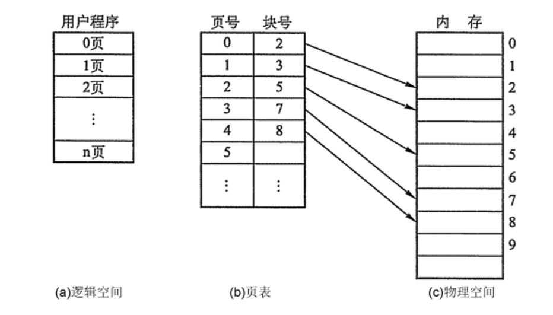

# 操作系统面试考点归纳

## 操作系统的主要功能

处理机管理：处理机分配都是以进程为单位，所以处理机管理也被看做是进程管理。包括进程控制，进程同步，进程通信和进程调度。
内存管理：内存分配，内存保护，地址映射，内存扩充。
设备管理：管理所有外围设备，包括完成用户的IO请求；为用户进程分配IO设备；提高IO设备利用率；提高IO速度；方便IO的使用。
文件管理：管理用户文件和系统文件，方便使用同时保证安全性。包括：磁盘存储空间管理，目录管理，文件读写管理以及文件共享和保护。
提供用户接口：程序接口（如API）和用户接口（如GUI）。

## 操作系统的四个特性 

**1.并发** ：同一段时间内多个程序执行(注意区别并行和并发，前者是同一时刻的多个事件，后者是同一时间段内的多个事件)
**2.共享** ：系统中的资源可以被内存中多个并发执行的进线程共同使用
**3.虚拟** ：通过时分复用（如分时系统）以及空分复用（如虚拟内存）技术实现把一个物理实体虚拟为多个
**4.异步** ：系统中的进程是以走走停停的方式执行的，且以一种不可预知的速度推进。

## 线程和进程

**线程：CPU可调度的最小单位** ，是程序执行流的最小单元；线程是进程中的一个实体，是被系统独立调度和分派的基本单位，线程自己不拥有系统资源，只拥有一点儿在运行中必不可少的资源，但它可与同属一个进程的其它线程共享进程所拥有的全部资源。

**进程：系统进行资源分配和调度的单位** 。一个执行单元，在PC 和移动设备上一般指一个程序或者应用，一个进程可以包含多个线程。每一个进程都有它自己的地址空间，一般情况下，包括文本区域（text region）、数据区域（data region）和堆栈（stack region）。 进程只是一些资源的集合，真正的程序执行都是线程来完成的，程序启动的时候操作系统就帮你创建了一个主线程。在一个进程中，多个线程可并发执行。

## 进程的状态与转换

创建状态：一个进程一般要通过以下两个步骤(1) 为一个新进程创建进程控制块(PCB)，并填写必要的管理信息.(2) 把该进程转入就绪状态并插入就绪队列之中。当进程已拥有了自己PCB，但进程自身还未进入主存，即创建工作尚未完成，进程还不能被调度运行，其所处的状态就是创建状态。

 就绪状态：进程已处于准备运行的状态，即进程获得了除处理机之外的一切所需资源，一旦得到处理机即可运行。

运行状态：进程正在处理机上运行。在单处理机环境下，每一时刻最多只有一个进程处于运行状态。

阻塞状态，又称等待状态：进程正在等待某一事件而暂停运行，如等待某资源为可用（不包括处理机）或等待输入/输出完成。即使处理机空闲，该进程也不能运行。

终止状态：操作系统将进程的PCB清零，并将PCB空间返还系统。当一个进程到达了自然结束点，或是出现了无法克服的错误，或是被操作系统所终结，或是被其他有终止权的进程所终结，它将进入终止状态。

**就绪状态 -> 运行状态：**处于就绪状态的进程被调度后，获得处理机资源（分派处理机时间片），于是进程由就绪状态转换为运行状态。

**运行状态 -> 就绪状态：**处于运行状态的进程在时间片用完后，不得不让出处理机，从而进程由运行状态转换为就绪状态。此外，在可剥夺的操作系统中，当有更高优先级的进程就 、 绪时，调度程度将正执行的进程转换为就绪状态，让更高优先级的进程执行。

**运行状态 -> 阻塞状态：**当进程请求某一资源（如外设）的使用和分配或等待某一事件的发生（如I/O操作的完成）时，它就从运行状态转换为阻塞状态。进程以系统调用的形式请求操作系统提供服务，这是一种特殊的、由运行用户态程序调用操作系统内核过程的形式。

**阻塞状态 -> 就绪状态：**当进程等待的事件到来时，如I/O操作结束或中断结束时，中断处理程序必须把相应进程的状态由阻塞状态转换为就绪状态。

## 进程调度算法

**先来先服务调度算法FCFS：**既可以作为作业调度算法也可以作为进程调度算法；按作业或者进程到达的先后顺序依次调度；因此对于长作业比较有利；

**短作业优先调度算法SJF：**作业调度算法，算法从就绪队列中选择估计时间最短的作业进行处理，直到得出结果或者无法继续执行；缺点：不利于长作业；未考虑作业的重要性；运行时间是预估的，并不靠谱 ；

**时间片轮转调度RR：**按到达的先后对进程放入队列中，然后给队首进程分配CPU时间片，时间片用完之后计时器发出中断，暂停当前进程并将其放到队列尾部，循环 ;

**多级反馈队列调度算法：**目前公认较好的调度算法；设置多个就绪队列并为每个队列设置不同的优先级，第一个队列优先级最高，其余依次递减。优先级越高的队列分配的时间片越短，进程到达之后按FCFS放入第一个队列，如果调度执行后没有完成，那么放到第二个队列尾部等待调度，如果第二次调度仍然没有完成，放入第三队列尾部…。只有当前一个队列为空的时候才会去调度下一个队列的进程。

**高相应比算法HRN：**响应比=(等待时间+要求服务时间)/要求服务时间；

##  进程通信的几种方式

管道( pipe )：管道是一种半双工的通信方式，数据只能单向流动，而且只能在具有亲缘关系的进程间使用。进程的亲缘关系通常是指父子进程关系。

有名管道 (named pipe) ： 有名管道也是半双工的通信方式，但是它允许无亲缘关系进程间的通信。

信号量( semophore ) ： 信号量是一个计数器，可以用来控制多个进程对共享资源的访问。它常作为一种锁机制，防止某进程正在访问共享资源时，其他进程也访问该资源。因此，主要作为进程间以及同一进程内不同线程之间的同步手段。

消息队列( message queue ) ： 消息队列是由消息的链表，存放在内核中并由消息队列标识符标识。消息队列克服了信号传递信息少、管道只能承载无格式字节流以及缓冲区大小受限等缺点。

信号 ( signal ) ： 信号是一种比较复杂的通信方式，用于通知接收进程某个事件已经发生。

共享内存( shared memory ) ：共享内存就是**映射一段能被其他进程所访问的内存** ，这段共享内存由一个进程创建，但多个进程都可以访问。共享内存是最快的 IPC 方式，它是针对其他进程间通信方式运行效率低而专门设计的。它往往与其他通信机制，如信号量，配合使用，来实现进程间的同步和通信。

套接字( socket ) ： 套解字也是一种进程间通信机制，与其他通信机制不同的是，它可用于不同机器间的进程通信（本质上是一种网络通信）。

## 中断

中断包括**软件中断**（不可屏蔽）和**硬件中断**。
软中断为内核触发机制引起，模拟硬件中断。
硬件中断又分为外部中断（可屏蔽）和内部中断（不可屏蔽）
外部中断为一般外设请求；内部中断包括硬件出错（掉电，校验，传输）和运算出错（非法数据，地址，越界，溢出）

## 死锁 

死锁是指多个进程在运行过程中，因为争夺资源而造成的一种僵局，如果没有外力推进，处于僵局中的进程就无法继续执行。

**死锁原因：** 

1. 竞争资源：请求同一有限资源的进程数多于可用资源数 。
2. 进程推进顺序非法：进程执行中，请求和释放资源顺序不合理，如资源等待链。

**死锁产生的必要条件:**   

1. 互斥条件:进程对所分配的资源进行排他性的使用 。
2. 请求和保持条件：进程被阻塞的时候并不释放申请到的资源 。
3. 不可剥夺条件：进程对于已经申请到的资源在使用完成之前不可以被剥夺 。
4. 循环等待条件：发生死锁的时候存在的一个 进程-资源 环形等待链。

**死锁处理： ** 

1. 预防死锁：破坏产生死锁的4个必要条件中的一个或者多个；实现起来比较简单，但是如果限制过于严格会降低系统资源利用率以及吞吐量 。
2. 避免死锁：在资源的动态分配中，防止系统进入不安全状态(可能产生死锁的状态)-如**银行家算法** 。 
3. 检测死锁：允许系统运行过程中产生死锁，在死锁发生之后，采用一定的算法进行检测，并确定与死锁相关的资源和进程，采取相关方法清除检测到的死锁。实现难度大 
4. 解除死锁：与死锁检测配合，将系统从死锁中解脱出来（撤销进程或者剥夺资源）。对检测到的和死锁相关的进程以及资源，通过撤销或者挂起的方式，释放一些资源并将其分配给处于阻塞状态的进程，使其转变为就绪态。实现难度大

## 内核态与用户态

为了避免用户进程直接操作内核，需要限制不同的程序之间的访问能力, 防止他们获取别的程序的内存数据, 或者获取外围设备的数据, 并发送到网络, CPU划分出两个权限等级 -- **用户态** 和 **内核态**。

**内核态:** 当一个进程执行系统调用而陷入内核代码中执行时，就称进程处于内核运行态。CPU可以访问**内存所有数据** ， 包括外围设备, 例如硬盘, 网卡。 CPU也可以将自己从一个程序切换到另一个程序

**用户态: **只能受限的访问内存, 且不允许访问外围设备. 占用CPU的能力被剥夺, CPU资源可以被其他程序获取。

**用户态切换到内核态的3种方式**

(1) 系统调用：这是用户态进程主动要求切换到内核态的一种方式，用户态进程通过系统调用申请使用操作系统提供的服务程序完成工作。而系统调用的机制其核心还是使用了操作系统为用户特别开放的一个中断来实现，例如Linux的int 80h中断。

(2)异常：当CPU在执行运行在用户态下的程序时，发生了某些事先不可知的异常，这时会触发由当前运行进程切换到处理此异常的内核相关程序中，也就转到了内核态，比如缺页异常。

(3)外围设备的中断：当外围设备完成用户请求的操作后，会向CPU发出相应的中断信号，这时CPU会暂停执行下一条即将要执行的指令转而去执行与中断信号对应的处理程序，如果先前执行的指令是用户态下的程序，那么这个转换的过程自然也就发生了由用户态到内核态的切换。比如硬盘读写操作完成，系统会切换到硬盘读写的中断处理程序中执行后续操作等。

## 分页式内存管理

把主存空间划分为大小相等且固定的块，块相对较小，作为主存的基本单位。每个进程也以块为单位进行划分，进程在执行时，以块为单位逐个申请主存中的块空间。

因为程序数据存储在不同的页面中，而页面又离散的分布在内存中，**因此需要一个页表来记录逻辑地址和实际存储地址之间的映射关系，以实现从页号到物理块号的映射。**

由于页表也是存储在内存中的，因此和不适用分页管理的存储方式相比，访问分页系统中内存数据需要**两次的内存访问**(一次是从内存中访问页表，从中找到指定的物理块号，加上页内偏移得到实际物理地址；第二次就是根据第一次得到的物理地址访问内存取出数据)。

为了减少两次访问内存导致的效率影响，分页管理中引入了**快表机制**，包含快表机制的内存管理中，当要访问内存数据的时候，首先将页号在快表中查询，如果查找到说明要访问的页表项在快表中，那么直接从快表中读取相应的物理块号；如果没有找到，那么访问内存中的页表，从页表中得到物理地址，同时将页表中的该映射表项添加到快表中(可能存在快表换出算法)。

## 分段式内存管理 

分页是为了提高内存利用率，而分段是为了满足程序员在编写代码的时候的一些逻辑需求(比如数据共享，数据保护，动态链接等)。

分段内存管理当中，**地址是二维的，一维是段号，一维是段内地址；其中每个段的长度是不一样的，而且每个段内部都是从0开始编址的**。由于分段管理中，每个段内部是连续内存分配，但是段和段之间是离散分配的，因此也存在一个逻辑地址到物理地址的映射关系，相应的就是段表机制。段表中的每一个表项记录了该段在内存中的起始地址和该段的长度。段表可以放在内存中也可以放在寄存器中。

访问内存的时候根据段号和段表项的长度计算当前访问段在段表中的位置，然后访问段表，得到该段的**物理地址**，根据该物理地址以及**段内偏移量** 就可以得到需要访问的内存。由于也是两次内存访问，所以分段管理中同样引入了联想寄存器。

##### 分段分页方式的比较

* 页是信息的物理单位，是出于系统内存利用率的角度提出的离散分配机制；段是信息的逻辑单位，每个段含有一组意义完整的信息，是出于用户角度提出的内存管理机制
* 页的大小是固定的，由系统决定；段的大小是不确定的，由用户决定。

## 页面置换算法 

**最佳置换算法：**将当前页面中**在未来最长时间内不会被访问的页置换出去** 。

**先进先出置换算法FIFO：**简单粗暴的一种置换算法，没有考虑页面访问频率信息。每次**淘汰最早调入的页面** 。

**最近最久未使用算法LRU：**算法赋予每个页面一个访问字段，用来记录上次页面被访问到现在所经历的时间t，每次置换的时候把t值最大的页面置换出去,即**移除距离现在最久没有使用的页面** 。

**最少使用算法LFU：**设置寄存器记录页面被访问次数，每次置换的时候置换当前访问次数最少的。

**时钟算法clock(也被称为是最近未使用算法NRU)：**页面设置一个访问位，并将页面链接为一个环形队列，页面被访问的时候访问位设置为1。页面置换的时候，如果当前指针所指页面访问为为0，那么置换，否则将其置为0，循环直到遇到一个访问为位0的页面。

**改进型Clock算法：**在Clock算法的基础上添加一个修改位，替换时根究访问位和修改位综合判断。优先替换访问位和修改位都是0的页面，其次是访问位为0修改位为1的页面。

## IO的控制方式 

要把外设的数据读入内存或把内存的数据传送到外设，一般都要通过CPU控制完成。 

1.查询(轮询)：它定时对各种设备轮流询问一遍有无处理要求。轮流询问之后，有要求的，则加以处理。在处理I/O设备的要求之后，处理机返回继续工作。

2.中断：处理器的高速和输入输出设备的低速是一对矛盾，是设备管理要解决的一个重要问题。为了提高整体效率，减少在程序直接控制方式中CPU之间的数据传送， 在中断方式下，中央处理器与I/O设备之间数据的传输步骤如下：

* 在某个进程需要数据时，发出指令启动输入输出设备准备数据
* 在进程发出指令启动设备之后，该进程放弃处理器，等待相关I/O操作完成。此时，进程调度程序会调度其他就绪进程使用处理器。
* 当I/O操作完成时，输入输出设备控制器通过中断请求线向处理器发出中断信号，处理器收到中断信号之后，转向预先设计好的中断处理程序，对数据传送工作进行相应的处理。 
* ⑷得到了数据的进程，转入就绪状态。在随后的某个时刻，进程调度程序会选中该进程继续工作。

3.DMA（DIRECT MEMORY ACCESS）
即直接存储器存取，是指外部设备不通过CPU而**直接与系统内存交换数据** 的接口技术。

三着的比较：

* 中断方式与查询方式相比，其优点是：①提高了CPU的工作效率，把CPU从查询方式漫长的等待时间中解放出来，使CPU和外设以及外设和外设之间能并行工作；②实时响应能力强，在具有多个中断源的系统中，查询方式要轮流对多个中断源进行查询，所需时间较长，很难满足外设的实时要求，而采用中断方式便可满足外设的实时性要求。
* 中断方式与DMA方式相比的不足之处是：中断方式传送数据的速度比DMA慢，不适于高速外设的要求。