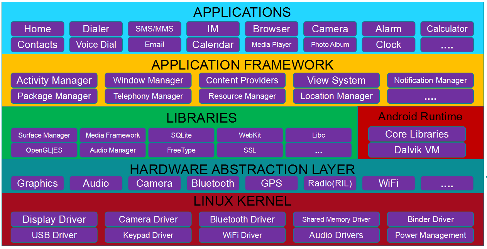
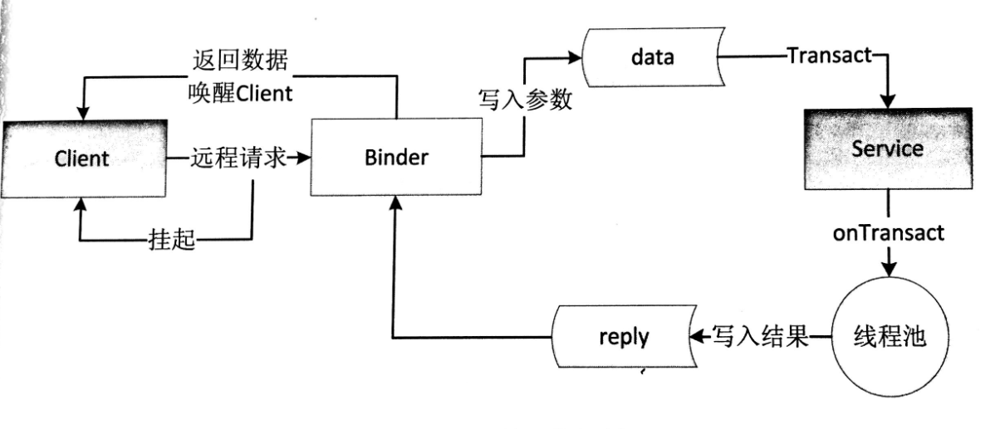
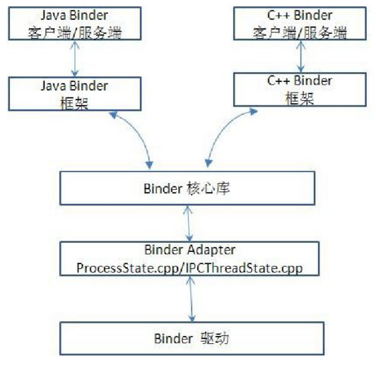
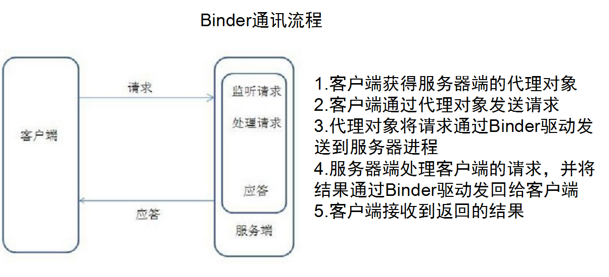
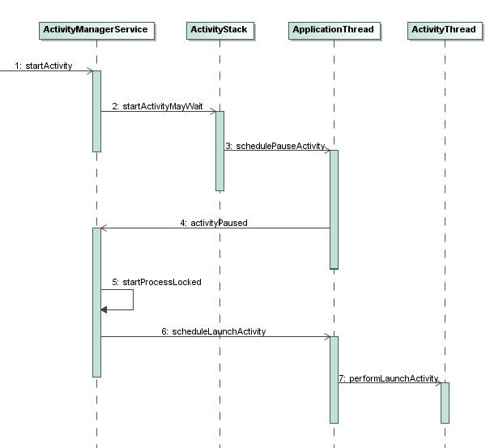

# 为面试做的一些准备

> The Chance should be taked by the one who was ready !  

下面是一些面试中常考的Android知识点归纳。

持续更新中~~


## Android 系统架构



1.应用程序层

Android平台不仅仅是操作系统，也包含了许多应用程序，诸如SMS短信客户端程序、电话拨号程序、图片浏览器、Web浏览器等应用程序。这些应用程序都是用Java语言编写的，并且这些应用程序都是可以被开发人员开发的其他应用程序所替换，这点不同于其他手机操作系统固化在系统内部的系统软件，更加灵活和个性化。

2.应用程序框架层

应用程序框架层是我们从事Android开发的基础，很多核心应用程序也是通过这一层来实现其核心功能的，该层简化了组件的重用，开发人员可以直接使用其提 供的组件来进行快速的应用程序开发，也可以通过继承而实现个性化的拓展。该层包括各种Manager，包括ActiviyManager，WindowManager等，还包括ContentProvider和View System。

3.系统运行库层

系统运行库层可以分成两部分，分别是系统库和Android运行时。系统库是应用程序框架的支撑，是连接应用程序框架层与Linux内核层的重要纽带。 Android应用程序时采用Java语言编写，程序在Android运行时中执行，其运行时分为核心库和Dalvik虚拟机两部分。

Dalvik和ART：

**什么是Dalvik？**
Dalvik是Google公司自己设计用于Android平台的虚拟机。
Dalvik虚拟机是Google等厂商合作开发的Android移动设备平台的核心组成部分之一。
它可以支持已转换为 .dex格式的Java应用程序的运行，.dex格式是专为Dalvik设计的一种压缩格式，适合内存和处理器速度有限的系统。
Dalvik 经过优化，允许在有限的内存中同时运行多个虚拟机的实例，并且每一个Dalvik 应用作为一个独立的Linux 进程执行。独立的进程可以防止在虚拟机崩溃的时候所有程序都被关闭。
很长时间以来，Dalvik虚拟机一直被用户指责为拖慢安卓系统运行速度不如IOS的根源。**2014年**，谷歌直接删除Dalvik，代替它的是传闻已久的ART。

**什么是ART？**
即Android Runtime
ART 的机制与 Dalvik 不同。在Dalvik下，应用每次运行的时候，字节码都需要通过即时编译器（just in time ，JIT）转换为机器码，这会拖慢应用的运行效率，而在ART 环境中，应用在第一次安装的时候，**字节码就会预先编译成机器码**，使其成为真正的本地应用。这个过程叫做预编译（AOT,Ahead-Of-Time）。这样的话，应用的启动(首次)和执行都会变得更加快速。

4.硬件抽象层HAL

HAL能以封闭源码的形式提供**硬件驱动模块**。其目的是把Android Framework与Linux Kernel隔开，让Android不至于过度依赖Linux Kernel，使开发人员不用了解具体设备特性，就可以通过硬件抽象层来获得各种设备的信息，以便于应用开发。

5.Linux内核层

Android是基于Linux内核，其核心系统服务如安全性、内存管理、进程管理、网路协议以及驱动模型都依赖于Linux内核。

## Activity 生命周期

在Activity的生命周期中，如下的方法会被系统回调：

onCreate(Bundle savedInstanceState)            Activity被创建时调用。

onStart()					  Activity已经启动，但还不可以与用户进行交互。

onResume()					  当Activity可见，并准备与用户交互。

onPause()				  	  暂停Activity时被调用，调用了该方法后，Activity变得不可交互。

onStop()					  停止Activity时被调用，Activity变得不可见。

onDestroy()					  销毁Activity时被调用。

onRestart()					  重启Activity时被调用，当Activity从不可见重新变为可见时，就会调用该方法。


## Activity的四种加载模式以及使用场景

**standard 模式**

这是默认模式，每次激活Activity时都会创建Activity实例，并放入任务栈中。使用场景：大多数Activity。

**singleTop 模式**

如果在任务的栈顶正好存在该Activity的实例，就重用该实例( 会调用实例的 onNewIntent() )，否则就会创建新的实例并放入栈顶，即使栈中已经存在该Activity的实例，只要不在栈顶，都会创建新的实例。使用场景如新闻类或者阅读类App的内容页面。

**singleTask 模式**

如果在栈中已经有该Activity的实例，就重用该实例(会调用实例的 onNewIntent() )。重用时，会让该实例回到栈顶，因此在它上面的实例将会被移出栈。如果栈中不存在该实例，将会创建新的实例放入栈中。使用场景如浏览器的主界面。不管从多少个应用启动浏览器，只会启动主界面一次，其余情况都会走onNewIntent，并且会清空主界面上面的其他页面。

**singleInstance 模式**

在一个新栈中创建该Activity的实例，并让多个应用共享该栈中的该Activity实例。一旦该模式的Activity实例已经存在于某个栈中，任何应用再激活该Activity时都会重用该栈中的实例( 会调用实例的 onNewIntent() )。其效果相当于多个应用共享一个应用，不管谁激活该 Activity 都会进入同一个应用中。使用场景如闹铃提醒，将闹铃提醒与闹铃设置分离。singleInstance不要用于中间页面，如果用于中间页面，跳转会有问题，比如：A -> B (singleInstance) -> C，完全退出后，在此启动，首先打开的是B。


## 如何理解Activity，View，Window三者之间的关系？

打个比方。Activity像一个工匠（控制单元），Window像窗户（承载模型），View像窗花（显示视图）LayoutInflater像剪刀，Xml配置像窗花图纸。

1：Activity构造的时候会初始化一个Window，准确的说是PhoneWindow。

2：这个PhoneWindow有一个“ViewRoot”，这个“ViewRoot”是一个View或者说ViewGroup，是最初始的根视图。

3：“ViewRoot”通过addView方法来一个个的添加View。比如TextView，Button等

4：这些View的事件监听，是由WindowManagerService来接受消息，并且回调Activity函数。比如onClickListener，onKeyDown等。

## Activity与Fragment通信


## Service

创建自定义Service需要重写父类的如下方法：

* void onCreate()：该方法在该Service第一次被创建时调用。
* int onStartCommand(Intent intent，int flags，intstartId)：当应用程序通过startService()的方式启动Service时，会调用该方法。
* IBinder onBind(Intent intent)：当Service通过绑定的方式启动时，会调用该onBind()方法，该方法返回一个IBinder对象，应用程序可以通过IBinder对象与Service通信。
* boolean onUnbind(Intent intent)：当该Service上绑定的所有客户端都断开连接时，会触发该方法。
* void onDestroy(Intent intent)：当Service被销毁时触发该方法。

Service有两类：

**1：本地服务**， Local Service 用于应用程序内部。在Service可以调用Context.startService()启动，调用Context.stopService()结束。 在内部可以调用Service.stopSelf() 或 Service.stopSelfResult()来自己停止。无论调用了多少次startService()，都只需调用一次 stopService()来停止。

**2：远程服务**， Remote Service 用于android系统内部的应用程序之间。可以定义接口并把接口暴露出来，以便其他应用进行操作。客户端建立到服务对象的连接，并通过那个连接来调用服 务。调用Context.bindService()方法建立连接，并启动，以调用 Context.unbindService()关闭连接。多个客户端可以绑定至同一个服务。如果服务此时还没有加载，bindService()会先加 载它。
提供给可被其他应用复用，比如定义一个天气预报服务，提供与其他应用调用即可。使用远程服务需要借助AIDL来进行跨进程通讯。

Service生命周期图一：


通过start方式启动Service，则生命周期函数调用为：
context.startService() ->onCreate()- >onStartCommand()->Service running--调用context.stopService() ->onDestroy() 

通过bind方式启动Service:
context.bindService()->onCreate()->onBind()->Service running--调用>onUnbind() -> onDestroy() 

Service生命周期图二：


Service生命周期图三：


**同一服务，多次使用start()启动时**

第一次 启动服务时，运行 onCreate -->onStartCommand

后面在启动服务时，服务只执行onStartCommand，不再执行OnCreate

**同一服务A，用任何组件多次bind服务A时**

第一次绑定时会调用onCreate->onBind()。随后无论哪个组件再绑定几次该Service。服务A的onCreate()和onBind()只调用一次。

## Binder机制

[Linux](http://lib.csdn.net/base/linux)已经拥有的进程间通信IPC手段包括(Internet Process Connection)： 管道（Pipe）、信号（Signal）和跟踪（Trace）、插口（Socket）、报文队列（Message）、共享内存（Share Memory）和信号量（Semaphore）。

而Android采用的是Binder。**Binder基于Client-Server通信模式，传输过程只需一次拷贝，为发送发添加UID/PID身份，既支持实名Binder也支持匿名Binder，安全性高。**


Binder是Android中的一个类，它实现了IBinder接口，从IPC角度来说，Binder是Android中跨进程通讯的一种方式，Binder还可以理解为一种虚拟设备，它的设备驱动是/dev/binder，从Android Framework的角度来说，Binder是ServiceManager连接各种Manager(ActivityManager，WindowManager等等)的桥梁。从Android应用层来说，Binder是客户端与服务端进行通信的媒介，当bindService的时候，服务端就返回一个包含服务端业务的Binder对象， 通过这个Binder对象，客户端就可以获取**服务端提供的服务或者数据**，这里的服务包括普通服务和基于AIDL的服务。

Binder框架定义了四个角色：Server，Client，ServiceManager（以后简称SMgr）以及Binder驱动。其中Server，Client，SMgr运行于用户空间，驱动运行于内核空间。

Binder工作机制



### Binder机制包括以下五个部分：

* Binder驱动

  ​Binder驱动的核心是维护一个binder_proc类型的链表。里面记录了包括ServiceManager在内的所有Client信息，当Client去请求得到某个Service时，Binder驱动就去binder_proc中查找相应的Service返回给Client，同时增加当前Service的引用个数。

* Service Manager

  ​	Service Manager主要负责管理Android系统中所有的服务，当客户端要与服务端进行通信时，首先就会通过Service Manager来查询和取得所需要交互的服务。每个服务需要向Service Manager注册自己提供的服务。

* 服务端

  ​	通常是Android的系统服务，通过Service Manager可以查询和获取到某个Server。

* 客户端

  ​	一般指Android系统上的应用程序，它可以请求Server中的服务，常见的客户端是Activity。

* 服务代理

  ​	服务代理是指在客户端应用程序中生成的Server代理(Proxy)，从应用程序的角度看，代理对象和本地对象没有差别，都可以调用其方法，方法都是同步的，并且返回相应的结果。服务代理也是Binder机制的核心模块。

**Binder系统架构图**:



**Binder各组件之间的关系：**


**Binder通讯流程**



## IPC——跨进程通讯

### Serializable接口

使用方法：

serialVersionUID是用来辅助序列化和反序列化操作的，只有数据中的serialVersionUID和当前类中的serialVersionUID一样，才可以被反序列化。

```java
public class User implements Serializable{
  //声明一个serialVersionUID;
  private static final long serialVersionUID = 123L;
  
  public int userId;
  public String userName;
  public boolean isMale;
  ....
}
```

序列化：

```java
User user = new User(0,"jake",true);
ObjectOutPutStream out = new ObjectOutputStream(new FileOutputStream("cache.txt"));
out.writeObject(user);
out.close();
```

反序列化：

```java
ObjectInputStream in = new ObjectInputStream(new FileInputStream("cache.txt"));
User newUser = (User)in.readObject();
in.close();
```

### Parcelable接口

使用方法：

```java
public class User implements Parcelable{
  public int userId;
  public String userName;
  public boolean isMale;
  
  public Book book;//可序列化对象
  public User(int userId,String userName,boolean isMale){
    this.userId = userId;
    this.userName = userName;
    this.isMale = isMale;
  }
  //几乎在大部分情况下都返回0，只有当前对象中存在文件 描述符号时，该方法返回1
  public int describeContents(){
    return 0;
  }
  
  public void writeToParcel(Parcel out ,int flags){
    out.writeInt(userId);
    out.writeString(userName);
    out.writeInt(isMale?1:0);
    out.writeParcelable(book,0);
  }
  
  //反序列化
  public static final Parcelable.Creater<User> CREATOR = new Parcelable.Creator<User>() {
    public void createFromParcel(Parcel in){
      return new User(in);
    }
    public User[] newArray(int size){
      return new User[size];
    }
  }
  
  private User(Parcel in){
    userId = in.readInt();
    userName = in.readString();
    isMale = in.readInt() == 1;
    book = in.readParcelable(Thread.currentThread().getContextClassLoader());
  }
}


```


### 实现IPC的六种方式

简记：**A  B  C  F  S  M**

A--AIDl  B--Bundle  C--ContentProvider 

F--File    S--Socket   M--Mesenger     

1.使用Bundle      

android的四大组件都可使用Bundle传递数据  所以如果要实现四大组件间的进程间通信 完全可以使用Bundle来实现 简单方便  。

优点：**简单易用**

缺点：**只能传输Bundle支持的数据类型**

适用场景：**用于android四大组件间的进程间通信**。

2.文件共享

这种方式在单线程读写的时候比较好用， 如果有多个线程并发读写的话需要限制线程的同步读写 。另外 SharePreference是个特例  它底层基于xml实现  但是系统对它的读写会基于缓存，也就是说再多进程模式下就变得不那么可靠了，有很大几率丢失数据。

优点：**简单易用**

缺点：**不适合高并发场景，并且无法做到进程间的及时通讯**

适用场景：**无并发访问的情形，交换简单的数据，数据实时性要求不高的场景**。

3.AIDL

优点：**功能强大，支持一对多并行通信，支持实时通信**

缺点：**使用稍微复杂，需要处理好线程同步**

适用场景：**一对多通信，远程过程调用（RPC）的场景**

4.Messenger

Messenger 可以翻译为信使，通过该对象，可以在不同的进程中传递Message对象。

客户端向服务端发送消息，可分为以下几步。

服务端

- 创建Service
- 构造Handler对象，实现handlerMessage方法。
- 通过Handler对象构造Messenger信使对象。
- 通过Service的onBind()返回信使中的Binder对象。

客户端

- 创建Actvity
- 绑定服务
- 创建ServiceConnection,监听绑定服务的回调。
- 通过onServiceConnected()方法的参数，构造客户端Messenger对象
- 通过Messenger向服务端发送消息。

实现服务端

```java
public class MessengerService extends Service {
    //构建handler 对象
    public static Handler handler = new Handler(){
        public void handleMessage(android.os.Message msg) {
            // 接受客户端发送的消息
            String msgClient = msg.getData().getString("msg");
            Log.i("messenger","接收到客户端的消息--"+msgClient);
          // 获取客户端Messenger 对象
           Messenger messengetClient = msg.replyTo;
          
           // 向客户端发送消息
            Message message = Message.obtain();
            Bundle data = new Bundle();
            data.putString("msg", "ccccc");
            message.setData(data);
            try {
                // 发送消息
                messengetClient.send(message);
            } catch (RemoteException e) {
                // TODO Auto-generated catch block
                e.printStackTrace();
            }
        };
    };
    // 通过handler 构建Mesenger 对象
    private final Messenger messenger = new Messenger(handler);
    @Override
    public IBinder onBind(Intent intent) {
        // 返回binder 对象
        return messenger.getBinder();
    }
}
```

实现客户端

```java
public class MessengerActivity extends AppCompatActivity {  
    //Messenger 对象
    private Messenger mService;
  
   public static Handler handler = new Handler(){
        public void handleMessage(android.os.Message msg) {
            // 接受服务端发送的消息
            String msgService = msg.getData().getString("msg");
        };
    };
  
 // 通过handler 构建Mesenger 对象
    private final Messenger messengerClient = new Messenger(handler);
  
    private ServiceConnection conn = new ServiceConnection() {
        public void onServiceConnected(ComponentName name, IBinder service) {
            // IBinder 对象
            // 通过服务端返回的Binder 对象 构造Messenger 
            mService = new Messenger(service);
            Log.i("messenger", "客户端以获取服务端Messenger对象");
        }
        public void onServiceDisconnected(ComponentName name) {
        }
    };
    protected void onCreate(@Nullable Bundle savedInstanceState) {
        super.onCreate(savedInstanceState);
        setContentView(R.layout.activity_messenger);
        // 启动服务
        Intent intent = new Intent(this, MessengerService.class);
        bindService(intent, conn, BIND_AUTO_CREATE);
    }
    // 布局文件中添加了一个按钮，点击该按钮的处理方法
    public void send(View view) {
        try {
            // 向服务端发送消息
            Message message = Message.obtain();
            Bundle data = new Bundle();
            data.putString("msg", "lalala");
            message.setData(data);
          
            // ----- 传入Messenger 对象,这样客户端可以接受服务端传回来的消息
            message.replyTo = messengerClient;
          
            // 发送消息
            mService.send(message);
            Log.i("messenger","向服务端发送了消息");
        } catch (Exception e) {
            e.printStackTrace();
        }
    }
}
```

如果需要服务端和客户端能够双向通信，则在每一边都需要有Messenger和Handler，Messenger用来发送消息，在Handler中的handleMessage()中接受Message中的数据。

优点：**功能一般，支持一对多串行通信，支持实时通信**

缺点：**不能很好的处理高并发情形，只能传递Bundle能携带的数据**

适用场景：**低并发的一对多及时通信，无RPC需求**

5.ContentProvider

ContentProvider是Android中提供的，专门用于不同应用间进行数据共享的方式。

创建一个自定义的ContentProvider，继承ContentProvider，并实现六个方法：

```java
public class BookPrivider extends ContentProvider{
  public boolean onCreate(){
    *****
    //返回true则代表BookProvider已成功创建
    return true;
  }
  public String getType(Uri uri){
    ******
  }
  public Cursor query(Uri uri,String[] projection,String selection,String[] selectionArgs,String sortOrder){
    *****
  }
  public int delete(Uri uri,String selection,String[] selectionArgs){
  	****  
  }
  public Uri insert(Uri uri,ContentValues values){
    ****
  }
  public int update(Uri uri,ContentValues values,String selection,String[] selectionArgs){
    
    
  }
}
```

在AndroidManifest.xml中声明ContentProvider:

android:authorities是ContentProvider的唯一标识，android:permission是要求访问者必须声明的权限，如果没有这个权限，则不能访问。

```java
<provider
  android:name="xx.xxx.BookProvider"
  android:authorities="aaa.bbb.ccc"
  android:permission="rrr.ttt.bbb"
  >
</provider>
```

使用ContentResolver访问ContentProvider共享出来的数据：

```java
***
//这个Uri就是在content后面加上authorities
Uri uri = Uri.parse("content://aaa.bbb.ccc");
ContentResolver resolver = getContentResolver();
resolver.query(uri,null,null,null,null);
****
```

优点：**在数据源访问方面功能强大，支持一对多并发数据共享**

缺点：**这相当于一种受约束的AIDL，主要提供数据源的CRUD操作**

适用场景：**一对多的进程间的数据共享**

6.Socket

服务端：

```java
*****
//使用端口为参数，创建ServerSocket对象
ServerSocket ss = new ServerSocket(12345);
*****
// 获取客户端的Socket 对象
Socket socket = ss.accept();

// 获取输入流  --- 
BufferedReader br = new BufferedReader(new InputStreamReader(socket.getInputStream()));
// 通过输入流读取客户端的消息
//String line = br.readLine();
// 输出流
BufferedWriter bw = new BufferedWriter(new OutputStreamWriter(socket.getOutputStream()));
// 通过输出流向客户端发送消息
//bw.write("....");

// 关闭连接
socket.close();
```

客户端：

```java
**** 
Socket s = new Socket("localhost", 12345);
// ----- 和服务端类似
BufferedReader br = new BufferedReader(new InputStreamReader(s.getInputStream()));
//String line = br.readLine();
// 输出流
BufferedWriter bw = new BufferedWriter(new OutputStreamWriter(s.getOutputStream()));
//bw.write("....");
// 关闭连接
s.close();
```

优点：**功能强大，可以通过网络传输字节流，支持一对多并发实时通信**

缺点：**实现细节有点繁琐，不支持RPC**

适用场景：**网络数据交换**


---

## Handler实现原理

* Message

* MessageQueue

* Looper

  ​

  ​

  ​


## 自定义View 

### 分类

**1.继承View并重写onDraw()方法**

这种方法主要用于实现一些不规则的效果，需要通过绘制的方式实现，即重写onDraw方法，采用这种方式需要自己支持wrap_content，并且padding也要自己处理。

**2.继承ViewGroup派生特殊的Layout**

这种方法主要用于实现自定义的布局，当某种效果看起来很像几种View组合在一起的时候，可以采用这种方法，需要合适的处理ViewGroup的测量、布局这两个过程，并同时处理子元素的测量和布局过程。

**3.继承特定的View（如TextView）**

这种方法比较常见，一般用于扩展某种已知View的功能，不需要自己支持wrap_content和padding

4.**继承特定的ViewGroup**（如RelativeLayout）

这种方法也比较常见，采用这种方法不需要自己处理ViewGroup的测量和布局这两个过程，和2的主要差别在于方法2更接近View的底层。


## View的绘制流程


## 自定义属性

1.在value目录下创建自定义属性的xml，文件名随意起，比如attr.xml

```java
<?xml version="1.0" encoding="utf-8"?>
<resources>
   <declare-styleable name="CircleView">
      <attr name="circle_color" format="color"/>
  	  /*****/
   </declare-styleable>
</resources>
```

2.布局文件中使用自定义属性

```java
...
xmlns:app="http://schemas.android.com/apk.res-auto"
...

<com.XXX.CircleView
    ...
    app:circle_color="@color/light_green"
    ...
    />
```

3.在View构造方法中解析自定义属性（使用TypedArray）

```java

      
public CircleView(Context context, AttributeSet attrs, int defStyleAttr){
   super(context, attrs, defStyleAttr);
   TypedArray a = context.obtainStyledAttributes(attrs, R.styleable.CircleView);
   mColor = a.getColor(R.styleable.CircleView+circle_color, Color.RED);
   a.recycle();
   init();
}
```


## Touch事件的传递机制


## Android中的几种动画

### 逐帧动画


### 补间动画


### 属性动画


## AIDL

Android Interface Defining Language，Android接口定义语言。引入AIDL目的是为了实现进程间通信，尤其是在涉及多进程并发情况下的进程间通信。

使用AIDL：

1.在xxx.aidl文件中定义AIDL接口（在module目录下创建aidl文件夹，然后将xxx.aidl文件放在这个文件夹）

```java
interface IMessage{
  String getMessage();
  ***
}
```


2.把项目Rebuild之后，Android Studio会自动为AIDL接口生成一个接口IMessage，该接口继承IInterface，IMessage接口中有一个抽象类Stub，该Stub继承了Binder，并实现了IMessage。这样就可以在Java代码中使用IMessage。

```java
public interface IMessage extends android.os.IInterface{
  *****
  //抽象类Stub
  public static abstract class Stub extends android.os.Binder implements IMessage{
    *****
    public boolean onTransact(int code,Parcel data,Parcel reply,int flags){
      //AIDL接口中的方法是由这个int型的code来标识的
      switch(code){
        case TRANSACTION_getMessage:{
          ****
            break;
        }
        case ****
          ****
          break;
      }
    }
    *****
  }
  
  //代理类Proxy
  private static class Proxy implements IMessage{
    private android.os.IBinder mRemote;
    ****
    //adBinder()返回的是代理对象mRemote
    public android.os.IBinder asBinder(){
      return mRemote;
    }
  }
  public String getMessage(){
    *****
  }
}
```

3.自定义Service（AIDL一般用来调用远程服务）

```java
public class RemoteService extends Service{
  private IMessage.Stub stub = new IMessage.Stub{
    //这里写的是getMessage的具体实现
    public String getMessage(){
      return "Hello Kotlin";
    }
    public void onCreate(){
    	****  
    }
    public int onStartCommand(Intent intent,int flags,int startId ){
      ****
    }
    ****
  }
}
```

4.使用RemoteService

```java
****
private IMessage serv;
//创建ServiceConnection对象
ServiceConnection conn = new ServiceConnection(){
  public void onServiceConnected(ComponentName name,IBinder  service){
    serv = IMessage.Stub.adInterface(service);
    String msg = serv.getMessage();
  }
  public void onServiceDisconnected(ComponentName name){
    ****
  }
  
 ***** 
  //在绑定RemoteService的地方
  Intent intent = new Intent();
  intent.setAction("aa.aa.aaaa");
  intent.setPackage("xx.xx.xx");
  bindService(intent,conn,BIND_AUTO_CREATE);
}
```


## 应用程序Activity的启动过程

有两种操作会引发Activity的启动，

* 一种是用户点击应用程序图标时，Launcher会为我们启动应用程序的主Activity；应用程序的默认Activity启动起来后，它又可以在内部通过调用startActvity接口启动新的Activity，依此类推，每一个Activity都可以在内部启动新的Activity。通过这种连锁反应，按需启动Activity，从而完成应用程序的功能。
* 通过startActivity的形式启动另一个Activity

无论是通过哪种方式启动，要借助于应用程序框架层的**ActivityManagerService**服务进程。而Service也是由ActivityManagerService进程来启动的。

**在Android应用程序框架层中，ActivityManagerService是一个非常重要的接口，它不但负责启动Activity和Service，还负责管理Activity和Service。**

Android应用程序框架层中的ActivityManagerService启动Activity的过程大致如下图所示：



ActivityManagerService和ActivityStack位于同一个进程中，而ApplicationThread和ActivityThread位于另一个进程中。其中，

1. **ActivityManagerService是负责管理Activity的生命周期的**。
2. ActivityManagerService还借助ActivityStack是来把所有的Activity按照后进先出的顺序放在一个任务栈中。
3. **对于每一个应用程序来说，都有一个ActivityThread来表示应用程序的主进程**，而每一个ActivityThread都包含有一个ApplicationThread实例，它是一个Binder对象，负责和其它进程进行通信。

Activity的启动过程是：

1. 无论是通过Launcher来启动Activity，还是通过Activity内部调用startActivity接口来启动新的Activity，都通过Binder进程间通信进入到ActivityManagerService进程中，并且调用ActivityManagerService.startActivity接口； 
2. ActivityManagerService调用ActivityStack.startActivityMayWait来做准备要启动的Activity的相关信息；
3. ActivityStack通知ApplicationThread要进行Activity启动调度了，这里的ApplicationThread代表的是调用ActivityManagerService.startActivity接口的进程，对于通过点击应用程序图标的情景来说，这个进程就是Launcher了，而对于通过在Activity内部调用startActivity的情景来说，这个进程就是这个Activity所在的进程了；
4. ApplicationThread不执行真正的启动操作，它通过调用ActivityManagerService.activityPaused接口进入到ActivityManagerService进程中，看看是否需要创建新的进程来启动Activity；
5. 对于通过点击应用程序图标来启动Activity的情景来说，ActivityManagerService在这一步中，会调用startProcessLocked来创建一个新的进程，而对于通过在Activity内部调用startActivity来启动新的Activity来说，这一步是不需要执行的，因为新的Activity就在原来的Activity所在的进程中进行启动；
6. ActivityManagerServic调用ApplicationThread.scheduleLaunchActivity接口，通知相应的进程执行启动Activity的操作；
7. ApplicationThread把这个启动Activity的操作转发给ActivityThread，ActivityThread通过ClassLoader导入相应的Activity类，然后把它启动起来。

## 热修复


